# Yusi 后端详细设计文档

---

## 1. 系统架构概述

### 1.1 技术栈

| 层次 | 技术选型 | 说明 |
|:---|:---|:---|
| 基础框架 | Spring Boot 3.4.5 + Java 21 | 现代化 Java 栈 |
| 关系存储 | MySQL + ShardingSphere 5.5.0 | 分库分表，支持高并发写入 |
| 缓存层 | Redis + Redisson 3.26.0 | 分布式限流、热点数据缓存 |
| 向量存储 | Milvus | 语义检索、记忆向量存储 |
| AI 框架 | LangChain4j 1.12.2 | 统一 AI 模型集成 |
| 事件驱动 | Disruptor 4.0.0 | 高性能异步事件处理 |
| 通信协议 | gRPC + MCP | 跨语言服务调用、模型上下文协议 |

### 1.2 核心架构图

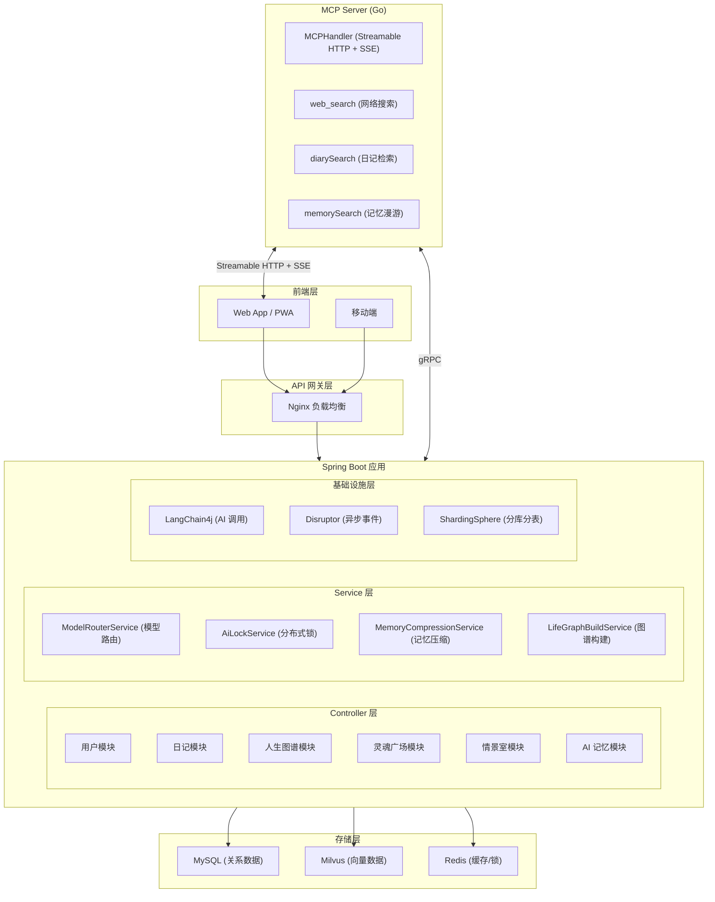

### 1.3 MCP Server 定位

MCP Server 是后端的扩展服务，用于对外部 AI 提供系统能力，实现 AI 记忆的"数字漫游"。

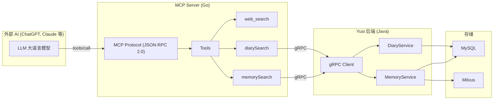

---

## 2. 数据库设计

### 2.1 ER 关系概览

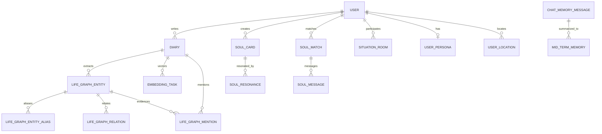

### 2.2 核心表结构

#### 2.2.1 用户与日记

| 表名 | 字段 | 类型 | 说明 |
|:---|:---|:---|:---|
| **user** | key_mode | VARCHAR(255) | DEFAULT(服务端密钥) / CUSTOM(用户自定义密钥) |
| | encrypted_backup_key | VARCHAR(1024) | 云端加密备份密钥 (RSA-OAEP) |
| **diary** | content | TEXT | 加密内容 (AES-GCM) |
| | client_encrypted | TINYINT(1) | true 时跳过服务端解密 |
| | images | TEXT(JSON) | OSS 图片 Key 列表 |

> **设计要点**：`content` 字段存储加密密文，client_encrypted=true 时保证端到端加密。

#### 2.2.2 人生图谱 (GraphRAG)

| 表名 | 设计要点 |
|:---|:---|
| **life_graph_relation** | 存储时强制 source_id < target_id，查询时 UNION 展开双向 |
| **life_graph_entity_alias** | alias_norm 归一化存储，实现别名消歧 |

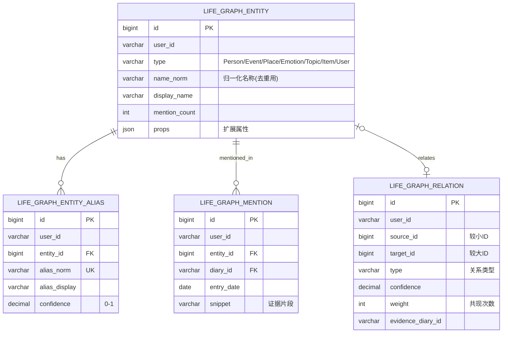

#### 2.2.3 AI 记忆

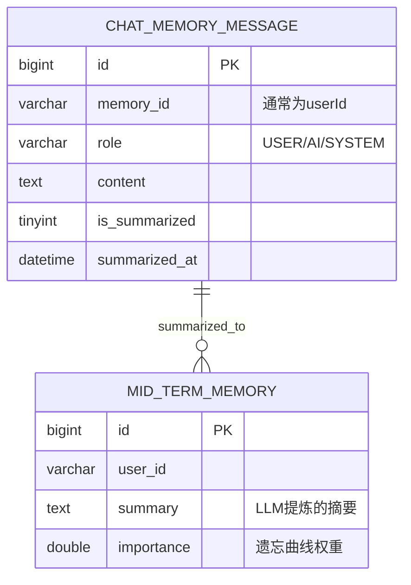

### 2.3 违背范式的设计说明

| 设计 | 违背范式 | 理由 |
|:---|:---|:---|
| diary.images 存储 JSON 数组 | 1NF (原子性) | 图片列表通常 1-9 张，JSON 数组查询虽有局限但可接受；拆分会导致 JOIN 性能下降 |
| situation_room.members 存储 JSON | 1NF | 成员数量 ≤8，JSON 存储避免关联表开销 |
| life_graph_entity.props 存储 JSON | 1NF | 不同类型实体属性差异大，动态 JSON 比 EAV 模式更灵活 |

---

## 3. 关键算法与技术

### 3.1 GraphRAG 实体关系抽取

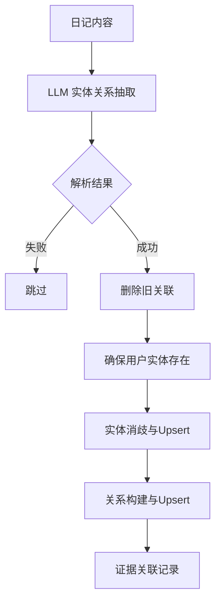

**别名归一化规则**：转小写 + 去空格，如"张三" → "zhangsan"

### 3.2 中期记忆压缩 (双轨触发 + 双阈值)

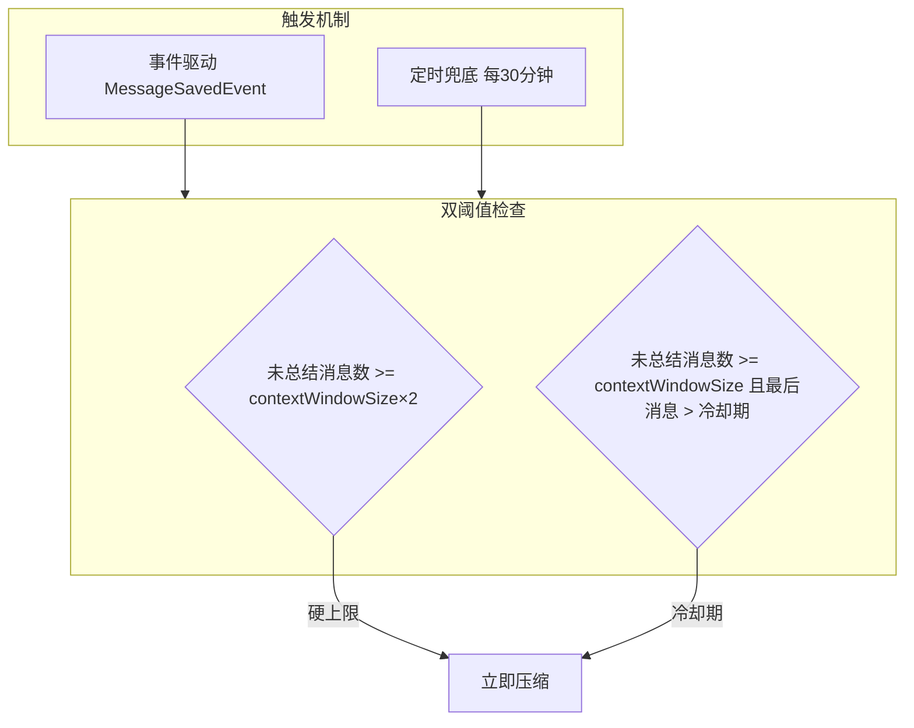

### 3.3 灵魂匹配 Feed 算法

**排序公式**：`FinalScore = (热度分数 + 时间分数) × 情感亲和权重`

| 因子 | 计算方式 |
|:---|:---|
| 热度分数 | log(1 + resonanceCount) × 10 |
| 时间分数 | 100 × e^(-hoursAgo / 72)，72小时半衰期 |
| 情感亲和权重 | 用户历史共鸣过该情感 ? 1.5 : 1.0 |

### 3.4 MCP Server 工具调用流程

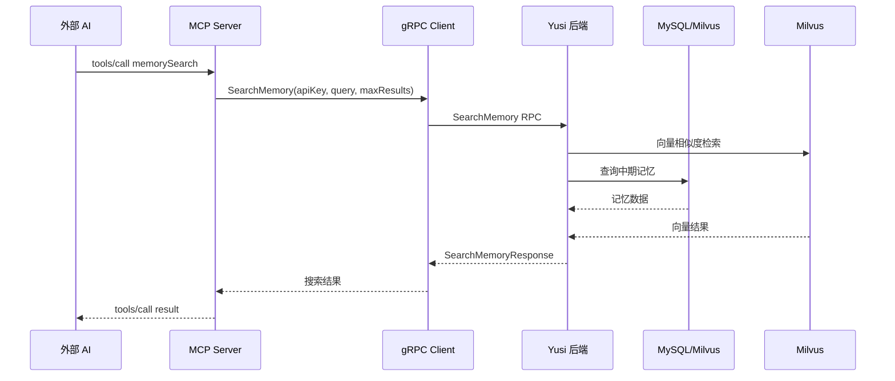

---

## 4. 核心模块设计

### 4.1 日记加密流程

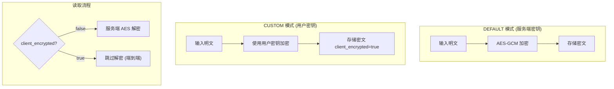

**CUSTOM 模式密钥恢复流程**：

1. 用户设置密钥时，生成随机 AES-256 密钥
2. 使用服务端 RSA 公钥加密，存入 encrypted_backup_key
3. 用户忘记密钥时，通过云端备份 + 服务端 RSA 私钥解密恢复

### 4.2 情景室状态机

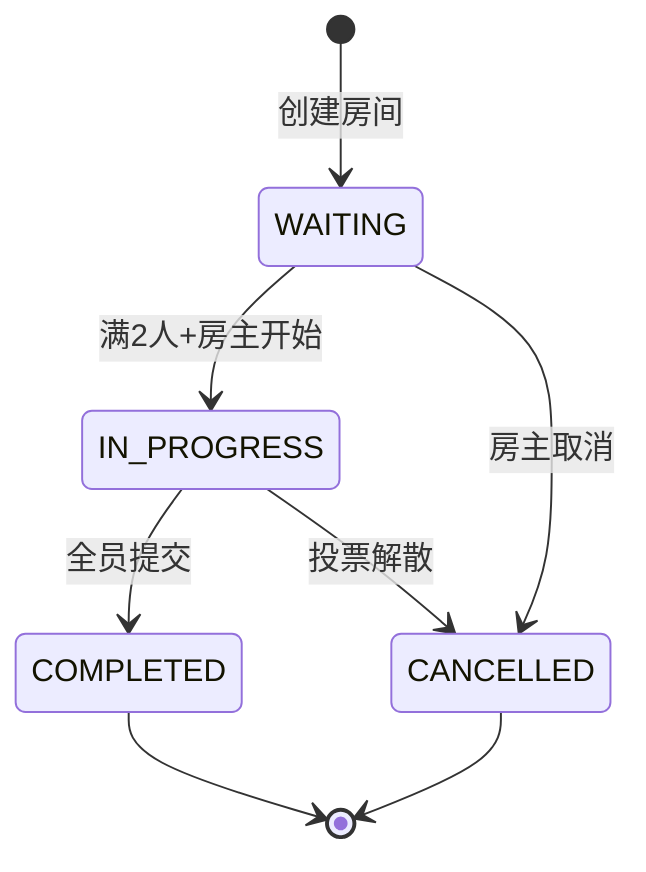

### 4.3 MCP Server 扩展工具

| 工具名称 | 功能 | 数据来源 |
|:---|:---|:---|
| web_search | 互联网实时信息搜索 | Bocha/Google/Serper/Tavily |
| diarySearch | 用户日记全文检索与解密 | MySQL |
| memorySearch | 综合记忆检索 (中期+短期+图谱) | MySQL + Milvus |

---

## 5. API 设计要点

### 5.1 统一响应格式

```java
public class Response<T> {
    private int code;       // 0=成功，非0=错误码
    private String message; // 错误描述
    private T data;        // 业务数据
}
```

### 5.2 缓存设计

| 缓存 Key 模式 | TTL | 说明 |
|:---|:---|:---|
| diary:detail:{diaryId} | 1h | 压缩存储 |
| diary:list:{userId}:{page}:{size} | 5min | 压缩存储 |
| plaza:feed:{userId}:{page}:{size}:{emotion} | 60s | 热门广场 Feed |
| @UpdateCache | 变更时删除 | 写操作自动失效 |

---

## 6. 安全设计

| 安全措施 | 实现方式 |
|:---|:---|
| 认证 | JWT Token (RS256 签名) |
| 密码存储 | BCrypt |
| 日记加密 | AES-GCM-256 |
| 云端密钥备份 | RSA-OAEP (服务端公钥加密) |
| 敏感词过滤 | DFA 算法 (sensitive-word 库) |
| SQL 注入 | JPA Parameterized Query |

---

## 7. 部署架构

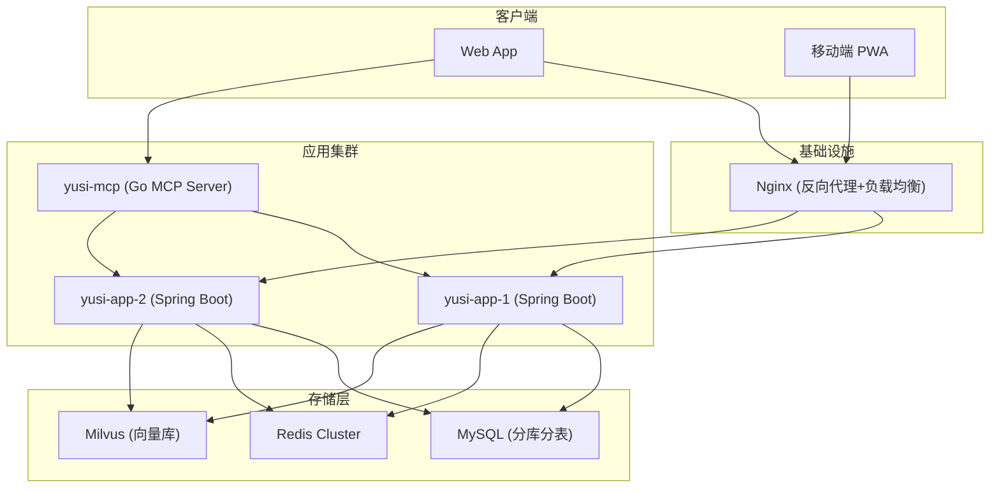

---

## 8. AI 模型治理框架

### 8.1 架构概览

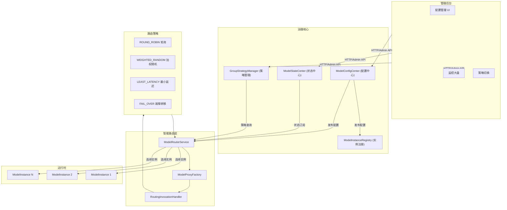

### 8.2 核心组件

| 组件 | 类 | 职责 |
|:---|:---|:---|
| 配置中心 | ModelConfigCenter | 配置热加载与 Redis 广播发布 |
| 实例注册表 | ModelInstanceRegistry | 模型实例动态创建，配置变更自动 reload |
| 状态中心 | ModelStateCenter | 熔断状态管理 (UP/HALF_OPEN/DOWN) |
| 策略管理器 | GroupStrategyManager | 分组策略 Redis 订阅 + 本地缓存 |
| 路由服务 | ModelRouterService | 根据 language/scene 解析分组 |
| 代理工厂 | ModelProxyFactory | 动态代理，集成熔断、重试 |

### 8.3 熔断机制 (三级状态机)

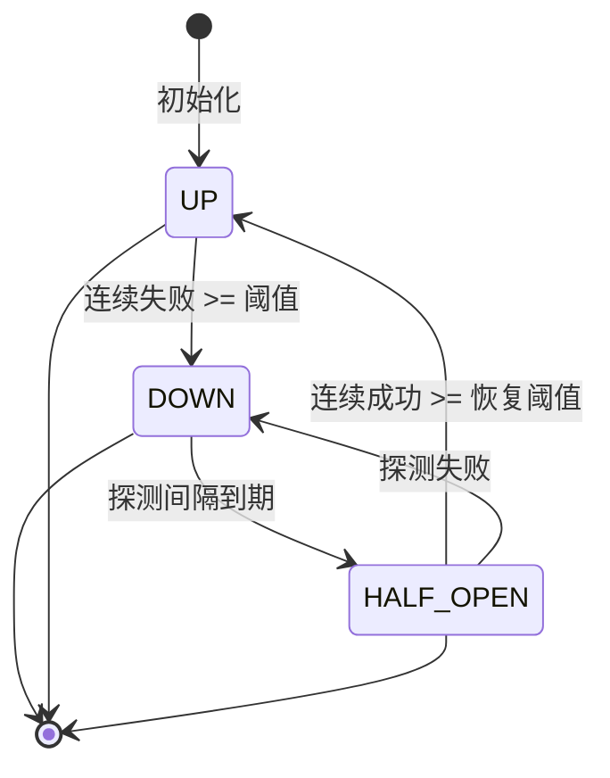

| 状态 | 允许请求 | 健康评分 | 说明 |
|:---|:---|:---|:---|
| UP | 正常 | 1 - errorRate | 正常运行 |
| HALF_OPEN | 探测比例放行 | 0.5 | 断路器半开，尝试恢复 |
| DOWN | 拒绝 | ≤0.2 | 熔断中，阻止请求 |

### 8.4 路由策略

| 策略 | 类 | 说明 |
|:---|:---|:---|
| ROUND_ROBIN | RoundRobinSelectionStrategy | 轮询所有可用实例 |
| WEIGHTED_RANDOM | WeightedRandomSelectionStrategy | 按权重加权随机 |
| LEAST_LATENCY | LeastLatencySelectionStrategy | 选择平均延迟最低的实例 |
| FAIL_OVER | FailOverSelectionStrategy | 优先级排序 + 熔断过滤 |

### 8.5 热重载流程

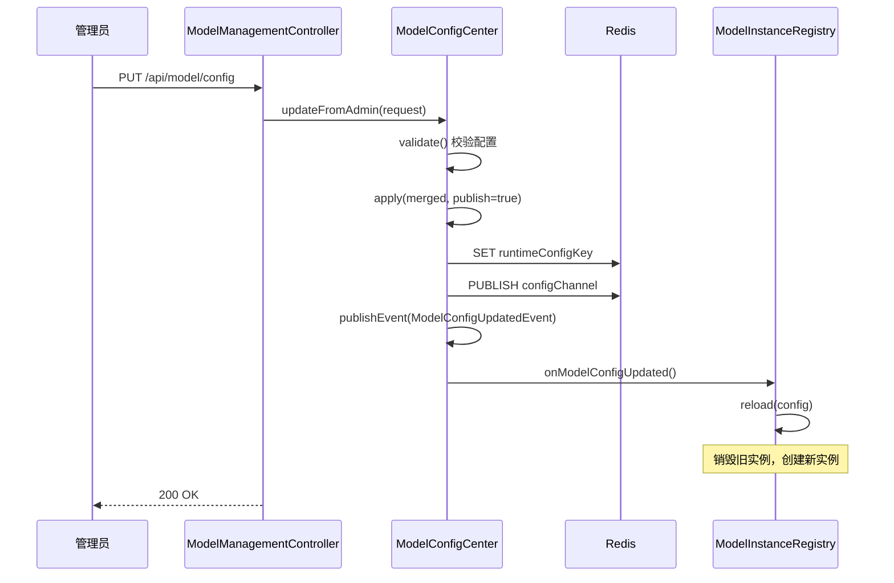

### 8.6 监控指标

| 指标 | 计算方式 | 用途 |
|:---|:---|:---|
| healthScore | 1 - errorRate | 综合健康度，熔断阈值参考 |
| qps | totalRequests / 时间窗口 | 实例负载评估 |
| avgLatencyMs | 滑动平均 | 延迟敏感路由依据 |
| consecutiveFailures | 连续失败计数 | 快速触发熔断 |
| phase | UP/HALF_OPEN/DOWN | 熔断状态 |

### 8.7 后台管理 API

| 接口 | 方法 | 说明 |
|:---|:---|:---|
| /api/model/config | GET | 获取模型配置 (API Key 脱敏) |
| /api/model/config | PUT | 更新模型配置 (热生效) |
| /api/model/states | GET | 获取所有实例运行时状态 |
| /api/model/groups/{group}/strategy | GET | 获取分组路由策略 |
| /api/model/groups/strategy/switch | POST | 切换分组路由策略 |

---

## 9. 关键技术亮点

| 亮点 | 说明 |
|:---|:---|
| GraphRAG 实践 | 基于 MySQL 实现图存储 + LLM 实体抽取 + 归一化消歧，绕过专用图数据库依赖 |
| 双轨记忆压缩 | 事件驱动 + 定时任务双保险，确保 AI 对话历史不丢失 |
| 端到端加密 | CUSTOM 模式下日记内容全程加密，服务端无法解密 |
| AI 模型治理 | 多策略智能路由 + 三级熔断 + 配置热更新 + 监控大盘 |
| Redis 降级限流 | 分布式限流在 Redis 故障时自动降级为单机限流 |
| MCP 数字漫游 | 通过 MCP 协议扩展，外部 AI 可直接查询用户日记与记忆，实现"数字分身" |

---

## 附录：MCP Server 详细设计

### A.1 核心组件

| 组件 | 文件 | 职责 |
|:---|:---|:---|
| MCPServer | server.go | 工具注册表、生命周期管理 |
| MCPHandler | handler/mcp.go | HTTP/SSE 协议处理、JSON-RPC 路由 |
| SearchDiaryTool | tools/extension_tools.go | 日记检索工具 |
| SearchMemoryTool | tools/extension_tools.go | 综合记忆检索工具 |
| gRPC Client | internal/grpc/client.go | 与后端 Java 服务通信 |

### A.2 通信协议

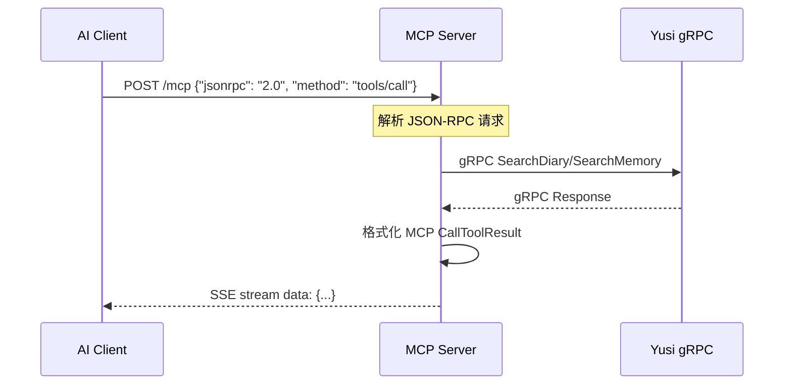

### A.3 工具定义 (memorySearch)

```json
{
  "name": "memorySearch",
  "description": "搜索用户的记忆信息，包括日记、人生图谱、中期记忆和短期记忆上下文",
  "inputSchema": {
    "type": "object",
    "properties": {
      "query": {
        "type": "string",
        "description": "搜索关键词或问题"
      },
      "maxResults": {
        "type": "integer",
        "description": "最大返回结果数量（默认 10）"
      }
    },
    "required": ["query"]
  }
}
```
