# Yusi 前端详细设计文档

---

## 1. 技术架构

### 1.1 技术栈

| 类别 | 技术选型 | 版本 |
|:---|:---|:---|
| 框架 | React | 19.2 |
| 语言 | TypeScript | 5.9 |
| 构建工具 | Vite (rolldown-vite) | 7.2 |
| 样式 | Tailwind CSS | 4.1 |
| 状态管理 | Zustand | 5.0 |
| 路由 | React Router | 7.9 |
| 动画 | Framer Motion | 12.x |
| 国际化 | i18next | 25.x |
| 富文本编辑器 | TipTap | 3.20 |
| UI 组件 | Radix UI | - |
| HTTP 客户端 | Axios | 1.13 |
| Toast 通知 | Sonner | 2.x |
| WebSocket | STOMP.js | 7.x |

### 1.2 项目结构

```
frontend/src/
├── components/               # 组件
│   ├── ui/                   # 基础 UI 组件
│   │   ├── Button.tsx
│   │   ├── Card.tsx
│   │   ├── Input.tsx
│   │   ├── Dialog.tsx
│   │   ├── Toast.tsx
│   │   └── ...
│   ├── admin/                # 管理后台组件
│   │   ├── AdminLayout.tsx
│   │   └── AdminGuard.tsx
│   ├── plaza/                # 广场组件
│   │   └── SoulCard.tsx
│   ├── room/                 # 情景室组件
│   │   ├── RoomChat.tsx
│   │   ├── RoomCreate.tsx
│   │   ├── RoomJoin.tsx
│   │   └── ...
│   ├── Diary.tsx
│   ├── Layout.tsx
│   ├── ChatWidget.tsx
│   └── ...
├── pages/                    # 页面
│   ├── Home.tsx
│   ├── Diary.tsx
│   ├── Login.tsx
│   ├── Register.tsx
│   ├── Plaza.tsx
│   ├── Match.tsx
│   ├── Room.tsx
│   ├── admin/                # 管理后台页面
│   │   ├── AdminDashboard.tsx
│   │   ├── ModelManagement.tsx
│   │   ├── UserManagement.tsx
│   │   └── ...
│   └── ...
├── lib/                      # 业务逻辑库
│   ├── api.ts                # API 封装
│   ├── crypto.ts             # 客户端加密
│   ├── diary.ts              # 日记相关
│   ├── plaza.ts              # 广场相关
│   ├── room.ts               # 情景室相关
│   └── lifegraph.ts          # 人生图谱相关
├── stores/                   # Zustand 状态管理
│   ├── authStore.ts           # 认证状态
│   ├── chatStore.ts           # 聊天状态
│   ├── themeStore.ts          # 主题状态
│   └── ...
├── i18n/                     # 国际化
│   ├── index.ts
│   └── locales/
│       ├── zh.json
│       └── en.json
├── hooks/                    # 自定义 Hooks
├── App.tsx                   # 根组件
└── main.tsx                  # 入口
```

### 1.3 架构图

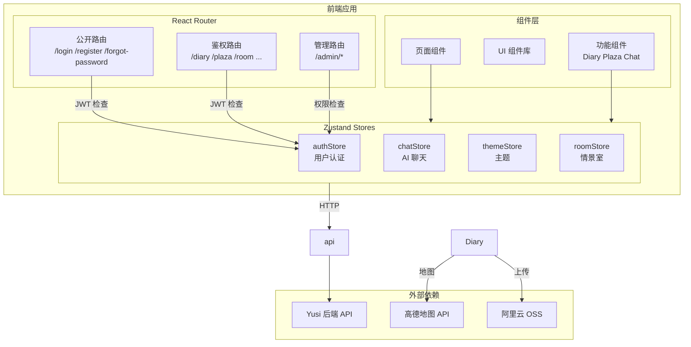

---

## 2. 核心模块设计

### 2.1 路由结构

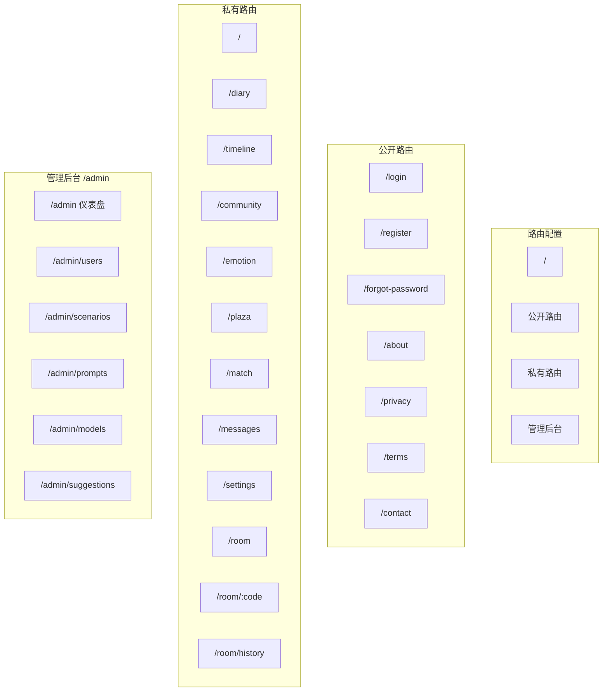

### 2.2 认证流程

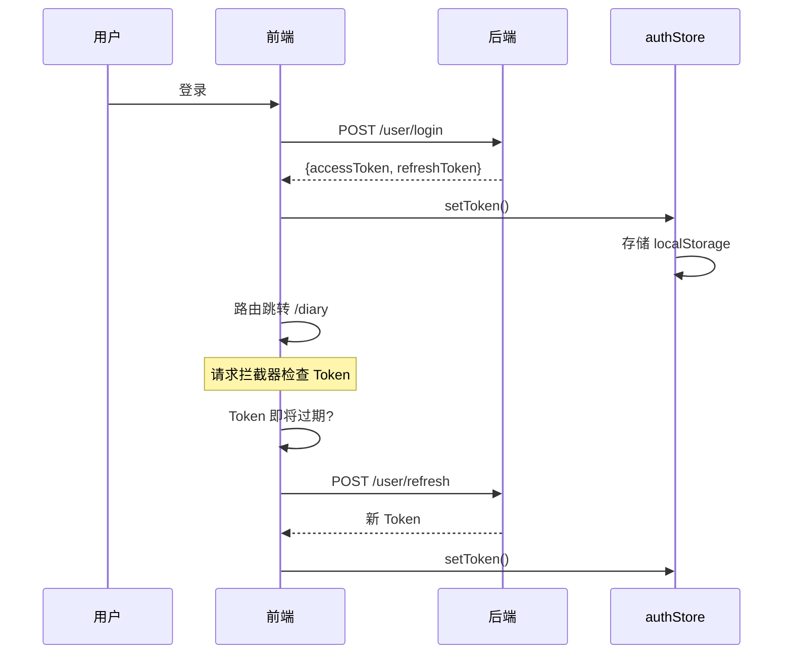

**Token 刷新机制**：
- 拦截器自动检测 Token 过期 (提前 60 秒)
- 维护刷新队列，避免并发刷新
- 401 时根据错误码判断是过期还是失效

### 2.3 客户端加密

```mermaid
flowchart TD
    subgraph Encrypt["加密流程 (CUSTOM 模式)"]
        A["用户输入密码"] --> B["PBKDF2 派生密钥<br/>100000 次迭代"]
        B --> C["生成随机 Salt + IV"]
        C --> D["AES-256-GCM 加密"]
        D --> E["Base64(Salt + IV + Cipher)"]
    end

    subgraph Decrypt["解密流程"]
        F["读取加密数据"] --> G["提取 Salt + IV"]
        G --> H["PBKDF2 派生密钥"]
        H --> I["AES-256-GCM 解密"]
        I --> J["明文内容"]
    end

    subgraph KeyBackup["密钥备份"]
        K["用户密码"] --> L["生成随机 AES-256 Key"]
        L --> M["RSA-OAEP 加密 Key"]
        M --> N["存入 encrypted_backup_key"]
    end
```

**加密参数**：

| 参数 | 值 |
|:---|:---|
| 算法 | AES-256-GCM |
| PBKDF2 迭代次数 | 100000 |
| Salt 长度 | 16 字节 |
| IV 长度 | 12 字节 |
| 密钥长度 | 256 位 |

---

## 3. 页面设计

### 3.1 首页 (/)

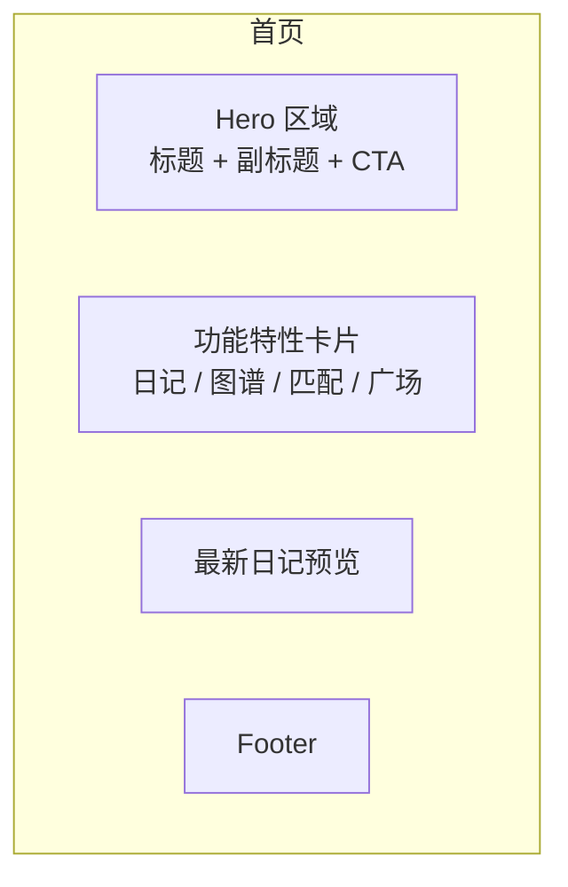

### 3.2 日记页面 (/diary)

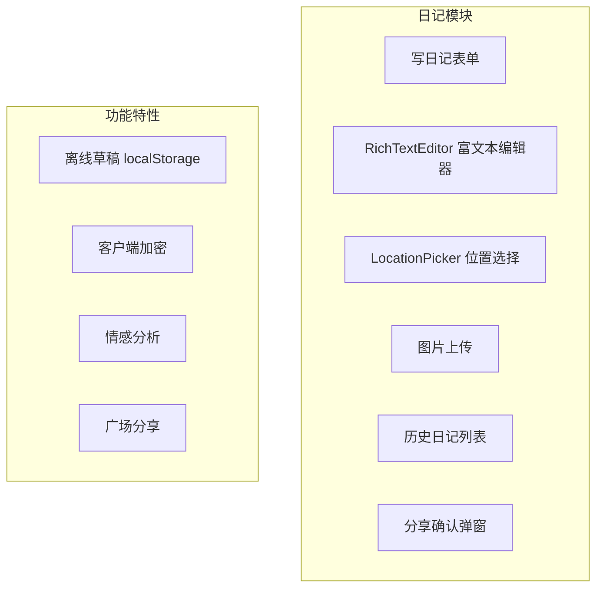

### 3.3 灵魂广场 (/plaza)

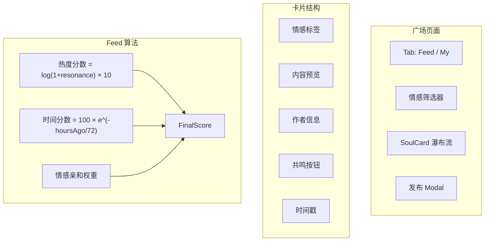

### 3.4 情景室 (/room)

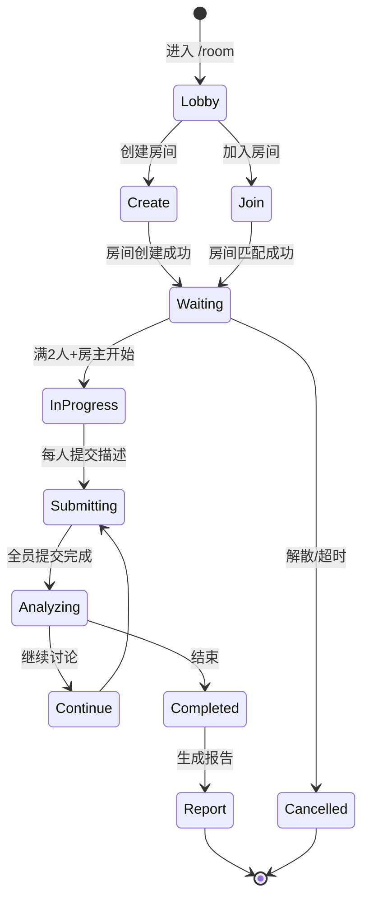

### 3.5 管理后台 (/admin)

| 页面 | 功能 |
|:---|:---|
| AdminDashboard | 统计数据看板 |
| UserManagement | 用户管理、权限设置 |
| ScenarioAudit | 情景审核 |
| PromptManagement | Prompt 模板管理 |
| ModelManagement | AI 模型配置、热更新 |
| SuggestionManagement | 建议管理 |

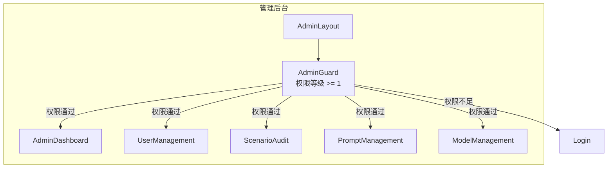

---

## 4. 组件设计

### 4.1 UI 组件库

| 组件 | 说明 |
|:---|:---|
| Button | 支持 primary/outline/ghost/danger 变体，loading 状态 |
| Input | 支持图标、错误状态 |
| Card | 玻璃态效果 (glass-card) |
| Dialog/ConfirmDialog | 确认对话框 |
| Select | 下拉选择 |
| Checkbox | 多选框 |
| Textarea | 文本域 |
| Toast | Sonner 封装 |
| Skeleton | 加载骨架屏 |
| EmptyState | 空状态展示 |
| Badge | 标签 |
| Sheet | 侧边抽屉 |

### 4.2 业务组件

| 组件 | 位置 | 说明 |
|:---|:---|:---|
| Diary | components/ | 日记编辑器+列表 |
| SoulCard | components/plaza/ | 广场卡片 |
| ChatWidget | components/ | AI 聊天浮窗 |
| SoulChatWindow | components/ | 灵魂匹配聊天窗口 |
| RichTextEditor | components/ui/ | TipTap 富文本编辑器 |
| LocationPicker | components/ | 高德地图位置选择器 |
| ThemeSwitcher | components/ | 主题切换 |
| LanguageSwitcher | components/ | 语言切换 |

### 4.3 组件设计模式

```typescript
// 示例：ConfirmDialog 使用组合模式
<ConfirmDialog
  isOpen={isOpen}
  title="确认删除"
  confirmText="删除"
  variant="danger"
  onConfirm={handleConfirm}
  onCancel={handleCancel}
>
  <div className="space-y-4">
    <p>确定要删除吗？</p>
  </div>
</ConfirmDialog>
```

---

## 5. 状态管理

### 5.1 Store 定义

| Store | 状态 | 方法 |
|:---|:---|:---|
| **authStore** | userId, token, refreshToken, user | login(), logout(), setToken() |
| **chatStore** | isOpen, initialMessage, initialDiaries[] | openChatWithContext(), openChatWithDiary() |
| **themeStore** | theme | setTheme(), toggleTheme() |
| **roomStore** | currentRoom, status | joinRoom(), leaveRoom(), submitContent() |

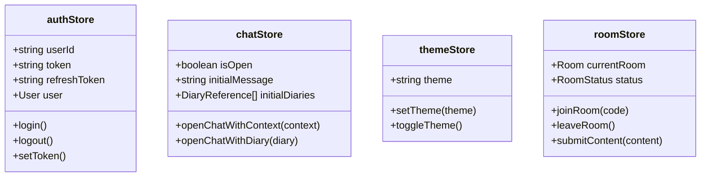

### 5.2 状态同步策略

| 状态 | 持久化 | 说明 |
|:---|:---|:---|
| authStore | localStorage | Token、用户信息 |
| themeStore | localStorage | 主题偏好 |
| chatStore | 内存 | 仅会话期有效 |
| roomStore | 内存 | 仅会话期有效 |

---

## 6. API 封装

### 6.1 Axios 拦截器

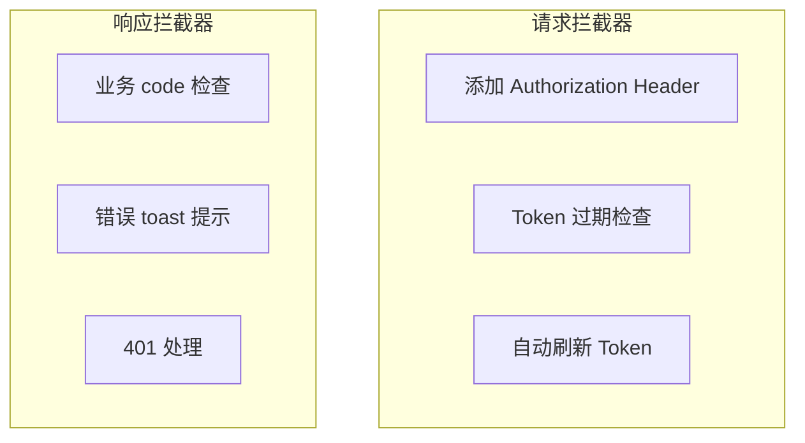

### 6.2 API 模块划分

| 模块 | 文件 | 说明 |
|:---|:---|:---|
| 认证 | api.ts - authApi | 登录、注册、Token 刷新 |
| 日记 | lib/diary.ts | CRUD、图片上传 |
| 广场 | lib/plaza.ts | Feed、卡片、共鸣 |
| 情景室 | lib/room.ts | 创建、加入、聊天 |
| 匹配 | api.ts - matchApi | 匹配设置、推荐 |
| 管理 | api.ts - adminApi | 统计数据、用户管理 |
| 模型 | api.ts - modelApi | 路由配置、运行时状态 |

---

## 7. 国际化

### 7.1 i18n 结构

```
i18n/
├── index.ts          # i18next 配置
└── locales/
    ├── zh.json       # 中文
    └── en.json       # 英文
```

### 7.2 支持语言

| 语言 | 代码 |
|:---|:---|
| 中文简体 | zh-CN |
| English | en |

### 7.3 使用方式

```typescript
import { useTranslation } from 'react-i18next'

const { t } = useTranslation()
return <span>{t('diary.pageTitle')}</span>
```

---

## 8. 样式设计

### 8.1 Tailwind CSS 配置

- 使用 CSS 变量实现主题切换
- 玻璃态效果：`glass-card`
- 渐变文字：`text-gradient`
- 暗色模式支持

### 8.2 主题变量

```css
:root {
  --background: #ffffff;
  --foreground: #1a1a1a;
  --primary: #6366f1;
  --primary-foreground: #ffffff;
  /* ... */
}

.dark {
  --background: #0a0a0a;
  --foreground: #fafafa;
  /* ... */
}
```

### 8.3 动画

| 动画 | 用途 |
|:---|:---|
| framer-motion | 页面过渡、组件动画 |
| animate-spin | 加载中 |
| animate-pulse | 心跳效果 |

---

## 9. 安全设计

| 安全措施 | 实现方式 |
|:---|:---|
| XSS 防护 | DOMPurify 净化 HTML |
| CSRF | 后端 SameSite Cookie |
| 密码强度 | 前端 validatePasswordStrength() |
| 端到端加密 | Web Crypto API + RSA-OAEP |
| 敏感信息 | localStorage 不存明文密码 |

---

## 10. 第三方集成

### 10.1 高德地图

- 位置选择器组件
- 地址 → 坐标转换
- POI 信息获取

### 10.2 阿里云 OSS

- 图片秒传 (MD5 去重)
- 分片上传 (大文件)
- URL 签名访问

### 10.3 WebSocket (STOMP)

- AI 聊天实时消息
- 情景室实时状态

---

## 11. PWA 支持

```yaml
# vite.config.ts
VitePWA:
  registerType: autoUpdate
  workbox:
    globPatterns: ['**/*.{js,css,html,ico,png,svg}']
  manifest:
    name: Yusi
    short_name: Yusi
    theme_color: #6366f1
    icons: [...]
```

---

## 12. 构建与部署

### 12.1 构建

```bash
npm run build  # tsc -b && vite build
```

### 12.2 Docker 部署

```dockerfile
# Dockerfile
FROM nginx:alpine
COPY dist/ /usr/share/nginx/html/
COPY nginx.conf /etc/nginx/conf.d/default.conf
EXPOSE 80
```

### 12.3 Nginx 配置要点

- SPA fallback (index.html)
- 静态资源缓存
- Gzip 压缩
- HTTPS 重定向
