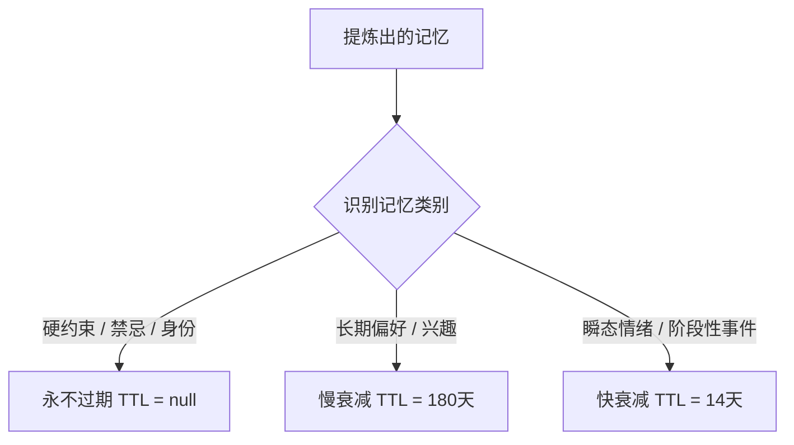

# Yusi 记忆系统优化提案：从“堆日志”走向“真记忆”

本提案结合微信公众号文章《你的 Agent 记忆系统，到底是在"记住"还是在"堆日志"？》的核心思想与 Yusi 项目当前的 Agent 记忆与认知架构，对 Yusi 的记忆系统进行审计，并提出具体、可落地的优化方案。

---

## 1. 核心思想对照：Yusi 现状 vs 文章标准

文章提出，一个真正的记忆系统（而非简单的日志堆叠）必须满足三个关键特征：**会提炼（Compression）**、**会遗忘（Forgetting）** 和 **会用上（Retrieval）**。

| 评估维度 | 微信文章倡导标准 | Yusi 现有实现评估 | 改善空间/优化点 |
| :--- | :--- | :--- | :--- |
| **会提炼 (Compression)** | • 分类提取：硬约束/身份不压缩；偏好/目标压缩；闲聊忽略。<br>• 异步批量写入（5-10轮）以降低延迟与成本。 | • **批处理机制**：通过双阈值策略（硬上限与冷却期）异步触发记忆总结，符合异步批量写入原则。<br>• **提取结构**：当前的 `MEMORY_EXTRACT` 为单一文本摘要，未对硬约束、偏好和瞬态情绪做明确分类。 | • 引入**结构化分类提取**：在记忆提炼中，将硬性禁忌、长期偏好和短期状态分离，输出结构化 JSON，存入不同的记忆区。 |
| **会遗忘 (Forgetting)** | • 衰减机制：不同类别记忆对应不同衰减曲线。<br>• 冲突覆写：新旧记忆语义比对，更新或失效旧记忆。<br>• 容量限制。 | • **衰减**：目前采用 30 天 TTL（`validUntil` 字段）的二值化过期策略，较粗暴。<br>• **冲突**：已实现认知冲突检测（`CognitiveConflictDetector`），但仅作提示注入，未自动执行数据库层面的覆写/失效。 | • 引入**分类软衰减**（如硬约束不衰减，情绪状态快速衰减）。<br>• 实现**主动冲突覆写**：高置信度的矛盾（如常驻地变更）直接在 DB 层面标记旧记忆失效。 |
| **会用上 (Retrieval)** | • 关键硬约束无条件注入上下文，避免向量检索遗漏。<br>• 时间归一化：消除“上周”、“昨天”等相对时间引用。<br>• 建立回归测试集评估检索率。 | • **上下文注入**：`ContextBuilderService` 注入了 `UserPersona` 和最新 3 条中期记忆，符合机制。<br>• **时间感知**：提供 `<current_time>`，但提炼记忆时未做相对时间的绝对化翻译。 | • **时间归一化**：在记忆提炼 prompt 中，要求 LLM 将所有相对时间描述（“昨天”、“下个月”）翻译为绝对日期。<br>• 建立**记忆检索评测集**（Regression Test Set）。 |

---

## 2. 优化方案详解

### 💡 方案一：结构化记忆分类提取与提示词增强 (Structured Memory Extraction)

#### 现状分析
当前的 `PromptKey.MEMORY_EXTRACT` 仅指导 LLM 做客观摘要：
```
请你作为一位极其敏锐的观察者，阅读以下用户与 AI 的对话记录... 提取结果必须精简、具体。
```
这会导致用户的**硬性约束**（如：“我讨厌喝咖啡”、“千万不要跟我提猫”）与**瞬态情绪**（如：“今天考试考砸了，很难受”）混在一起，导致记忆被存为扁平的文本，并在 30 天后统一面临过期。

#### 优化设计
1. **重新定义记忆提取格式**：
   修改记忆压缩阶段的 Prompt，要求其输出结构化 JSON 格式：
   ```json
   {
     "constraints": ["用户讨厌被直接说教", "不吃辣"], 
     "identity": ["用户是一名在上海工作的程序员"],
     "preferences": ["喜欢爵士乐 and 安静的咖啡馆"],
     "temporal_states": ["近期因为工作变动感到焦虑"]
   }
   ```
2. **分流存储与更新**：
   - 将 `constraints` 和 `identity` 动态合并入 `UserPersona` 的 `customInstructions` 与基本信息中，这些记忆**永不过期**，并在每次对话中**无条件注入** System Message 头部。
   - 将 `temporal_states` 存入 `MidTermMemory`，设置较短的有效期（如 14 天）。
   - 将 `preferences` 存入 `MidTermMemory`，设置较长的有效期（如 180 天）或作为图谱实体存储。

---

### 💡 方案二：分类软衰减与生命周期管理 (Category-based Soft Decay)

#### 现状分析
目前 Yusi 的中期记忆通过 `validUntil` 字段进行硬性过滤，30天后即完全不可见。但事实是：
- 用户的基本背景和禁忌（“对花生过敏”）不应过期；
- 用户的兴趣偏好（“最近想学网球”）可能维持数月；
- 用户的一时情绪（“今天和同事吵架了”）在 3 到 5 天后就不应在对话中作为主要上下文打扰用户。

#### 优化设计
引入基于**记忆类别（Memory Category）**的衰减机制：



在检索或上下文装配阶段，根据记忆的创建时间与类别，计算**动态关联权重**：
$$\text{Relevance} = \text{Base Importance} \times e^{-\lambda \times \text{Age}}$$
- 对于硬约束，$\lambda = 0$。
- 对于阶段性情绪，$\lambda = 0.15$（半衰期约 5 天）。

---

### 💡 方案三：自动化冲突覆写与记忆清理 (Conflict Overwrite Automation)

#### 现状分析
当前的 `CognitiveConflictDetector` 检测到冲突后：
1. 保存 `CognitiveConflict` 条目；
2. 注入上下文让 Agent 在聊天中“澄清”。
但这带来了**记忆冗余**。如果用户说“我上个月去北京工作了”（之前记录是“在上海工作”），如果不主动失效旧记忆，向量检索时可能同时召回“用户在上海工作”和“用户去北京工作了”，导致 Agent 产生幻觉或自相矛盾。

#### 优化设计
在 `MidMemoryFusionService` 的每日定时融合中，增加**冲突覆盖解析**：
1. 评估新旧两条有冲突的记忆，若 LLM 判定新旧记忆存在明确的排他性矛盾（如常驻地改变、关系状态改变），且置信度高：
   - 自动将旧记忆的 `validUntil` 更新为当前时间（即刻失效）；
   - 将旧记忆的 `mergedIntoId` 指向新记忆，并在新记忆中备注“（变更自：上海）”。
2. 若冲突为不确定性矛盾，保持原有逻辑：记录冲突，生成澄清任务，交由 Agent 在对话中向用户核实，待核实完毕后再更新。

---

### 💡 方案四：时间归一化与相对时间消除 (Temporal Normalization)

#### 现状分析
用户在日记中写“我**下个星期**要参加高考”或“我**昨天**失恋了”。
当 AI 把这句话直接压缩为 “用户下个星期要参加高考” 并存入 Milvus。如果 3 个月后用户问起这件事，向量检索召回“用户下个星期要参加高考”，Agent 就会给出错误的回答，因为相对时间引用丢失了。

#### 优化设计
在 `PromptKey.MEMORY_EXTRACT` 规则中增加**时间归一化指令**：
- 输入上下文时，将当前的系统日期（如 `current_date: 2026-07-09`）作为核心元数据传入。
- 指令要求：
  ```
  在提取记忆时，必须消除所有相对时间词汇。
  - “昨天” 翻译为 “在 2026-07-08”
  - “下周” 翻译为 “在 2026-07-16 左右”
  - 提取的记忆条目需呈现为绝对事实，例如：“用户于 2026-07-08 表达了对期末考试的焦虑。”
  ```

---

### 💡 方案五：记忆评测回归集建设 (Regression Test Set)

#### 优化设计
系统不能盲目调优 Prompt。我们应当引入一个轻量级的记忆召回评测机制：
1. **构建评测集**（保存在 `docs/testing/memory_regression_test.json`）：
   包含 30-40 个测试用例，覆盖：
   - **硬约束检索**（例：“我讨厌吃什么？”，预期召回：不要推荐花生/香菜）
   - **时间跨度检索**（例：“我去年夏天去了哪里？”，预期召回：去北京旅游的日记）
   - **情绪演变检索**（例：“我最近状态怎么样？”，预期召回：近期的焦虑状态）
2. **评测脚本**：
   编写一个单测或集成测试，通过 Mock 写入特定的记忆数据，然后模拟调用 `MemorySearchTool` 检索，计算 top-K 召回率（Hit Rate）和语义相关度得分。每次修改 Prompt 或检索算法时，跑一遍评测，确保召回率不发生倒退。

---

## 3. 落地实施路线图 (Phase 3+ 拓展)

配合 v4.0 的 Phase 3（认知进化）与 Phase 5（深度特性），建议的实施步骤如下：

```
                    【Phase A: 基础固化】
              • 优化 MEMORY_EXTRACT 提示词（时间归一化）
              • 结构化输出 JSON (约束/偏好/瞬态)
                       │
                       ▼
                    【Phase B: 生命周期】
              • 升级 MidTermMemory，支持分类 TTL (14天 / 180天)
              • 升级 ContextBuilderService 动态权重计算
                       │
                       ▼
                    【Phase C: 闭环融合】
              • 升级 MidMemoryFusionService 支持主动覆写
              • 建立 memory_regression_test.json 评测集
```

这些优化将使 Yusi 的 Agent 不仅能“记住”信息，更能像人类大脑一样，分清主次、理解时间、主动舍弃、动态更新，真正实现**“越陪伴，越懂你”**。
