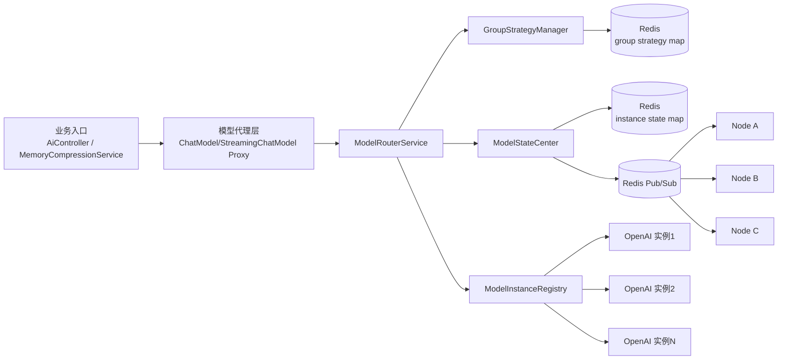
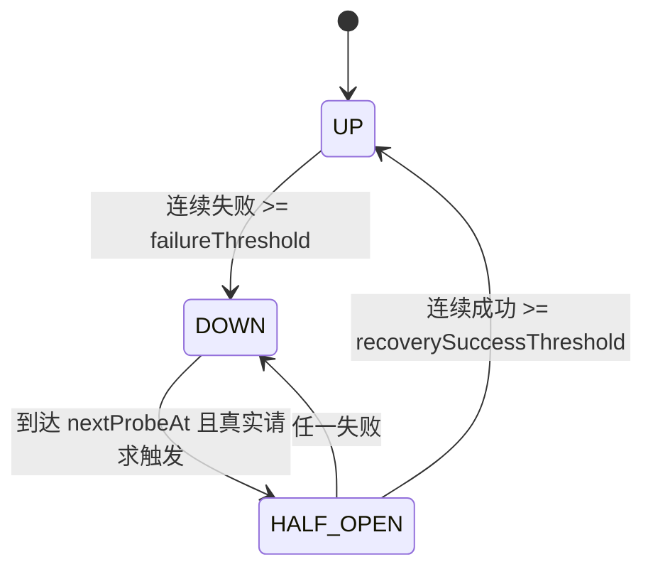

# 模型（Model）管理框架设计文档

## 1. 需求背景

现有系统已具备 Prompt 管理与热更新机制，但模型侧仍以静态 Bean 方式装配，无法满足以下诉求：

- 按语言（zh/en/ja）与场景（聊天、情景分析、记忆提取）进行多维路由
- 多实例运行时状态共享（健康度、QPS、延迟、可用性）
- 分组级动态策略切换（轮询、最低延迟、权重随机、故障转移）
- 零额外探针的被动监控与故障恢复
- 多节点间秒级状态一致性

为此在现有 Prompt 管理模式基础上，新增统一的模型治理层，实现“配置驱动 + 运行时动态决策 + Redis 共享状态”。

## 2. 总体架构



## 3. 核心数据模型

### 3.1 配置模型（YAML -> Properties）

- `ModelRoutingProperties`
  - `models[]`: 物理模型实例定义（endpoint/key/modelName/weight/priority/支持语言/支持场景）
  - `groups{}`: 模型组定义（成员列表 + 默认策略）
  - `matrix{language.scene -> group}`: 多维映射矩阵
  - `bindings{beanName -> 默认 scene/language/group}`: 业务 Bean 与路由绑定

### 3.2 运行时模型

- `ModelInstance`: 逻辑实例对象，封装 `ChatModel` 与 `StreamingChatModel`
- `ModelRuntimeState`: 实时指标快照
  - `available`, `healthScore`, `qps`, `avgLatencyMs`, `errorRate`
  - `total/success/failureRequests`
  - `consecutiveFailures`, `consecutiveSuccesses`
  - `phase(UP/HALF_OPEN/DOWN)`, `nextProbeAt`, `lastError`
- `ModelStateEvent`: 状态广播事件
- `GroupStrategyEvent`: 策略切换广播事件

### 3.3 Redis Key Schema

| Key | Type | 说明 |
|---|---|---|
| `yusi:model:state:instances` | Hash | `field=instanceId`，`value=ModelRuntimeState` |
| `yusi:model:group:strategies` | Hash | `field=groupId`，`value=strategyName` |
| `yusi:model:state:channel` | Pub/Sub Channel | 广播实例状态变化 |
| `yusi:model:group:strategy:channel` | Pub/Sub Channel | 广播组策略切换 |

## 4. 配置规范（YAML 示例）

```yaml
model:
  routing:
    default-language: zh
    default-scene: chat
    failure-threshold: 3
    recovery-success-threshold: 2
    recovery-probe-interval-ms: 15000
    models:
      - id: qwen-main
        baseurl: ${CHAT_MODEL_BASEURL}
        apikey: ${CHAT_MODEL_APIKEY}
        model: ${CHAT_MODEL_NAME}
        weight: 100
        priority: 1
        languages: [zh, en, ja]
        scenes: [chat, situation-analysis, memory-extract]
    groups:
      chat-zh:
        strategy: ROUND_ROBIN
        members: [qwen-main]
      analysis-zh:
        strategy: LEAST_LATENCY
        members: [qwen-main]
      memory-zh:
        strategy: FAIL_OVER
        members: [qwen-main]
    matrix:
      zh:
        chat: chat-zh
        situation-analysis: analysis-zh
        memory-extract: memory-zh
      en:
        chat: chat-zh
        situation-analysis: analysis-zh
        memory-extract: memory-zh
      ja:
        chat: chat-zh
        situation-analysis: analysis-zh
        memory-extract: memory-zh
    bindings:
      streamingChatModel:
        scene: chat
      logicModel:
        scene: situation-analysis
      chatModel:
        scene: situation-analysis
      jsonChatModel:
        scene: memory-extract
```

## 5. 状态机流转图（被动监控）



## 6. 选择策略算法伪代码

### 6.1 Round-Robin

```text
cursor = groupCursor[group]++
for i in [0..n):
  candidate = list[(cursor + i) % n]
  if candidate.available:
    return candidate
return list[cursor % n]
```

### 6.2 Least-Latency

```text
available = filter(list, available == true)
if available is empty: return first(list)
return argmin(available, avgLatencyMs)
```

### 6.3 Weighted-Random

```text
available = filter(list, available == true)
if available is empty: return first(list)
sum = Σ max(1, weight)
r = random(0, sum)
scan cumulative weight and return first cumulative > r
```

### 6.4 Fail-Over

```text
ordered = sortByPriorityAsc(list)
for candidate in ordered:
  if candidate.available:
    return candidate
return first(ordered)
```

## 7. 异常处理与降级策略

- 路由降级
  - `language+scene` 未命中时，回退默认语言矩阵
  - 组无可用实例时，回退首个成员（保证可执行）
- 故障降级
  - 实例连续失败触发 `DOWN`，选择层自动剔除
  - `DOWN` 状态仅在恢复窗口到达后由真实流量触发探测
- 恢复策略
  - `HALF_OPEN` 成功达到阈值后自动恢复 `UP`
  - `HALF_OPEN` 一次失败立即回落 `DOWN`
- 一致性保障
  - 所有状态变更与策略切换都写 Redis + Pub/Sub 广播
  - 各节点订阅事件并更新本地缓存，实现秒级收敛

## 8. 运行时热切换能力

通过管理接口可在运行时切换任意组的策略，无需重启：

- `POST /api/model/groups/strategy/switch`
- `GET /api/model/groups/{group}/strategy`
- `GET /api/model/states`

策略切换流程：

1. 写入 `yusi:model:group:strategies`
2. 发布 `GroupStrategyEvent`
3. 各节点订阅后更新本地策略缓存
4. 下一次请求立即按新策略生效

## 9. SQL 落地与执行说明

### 9.1 新增表

- `model_runtime_config`
  - 作用：持久化模型治理运行时全量配置（JSON）
  - 关键字段：`config_key`、`config_json`、`version`、`updated_at`
- `model_config_change_log`
  - 作用：记录配置更新/策略切换/回滚等治理动作
  - 关键字段：`change_id`、`action`、`before_json`、`after_json`、`success`

### 9.2 脚本位置

- 全量初始化脚本：`docs/sql/init.sql`
- 增量变更脚本：`docs/sql/update_model_management.sql`

### 9.3 执行顺序

1. 新环境：直接执行 `init.sql`
2. 存量环境：先备份，再执行 `update_model_management.sql`
3. 执行完成后验证：
   - 表存在：`model_runtime_config`、`model_config_change_log`
   - 索引存在：`uk_model_runtime_config_key`、`uk_model_config_change_log_change_id`

### 9.4 与 Redis 控制面的关系

- Redis 仍是实时控制面（低延迟读写、秒级广播）
- MySQL 承担持久化与审计职责（可追溯、可恢复）
- 推荐策略：
  - 配置更新时先写 MySQL，再写 Redis 并广播
  - 节点启动时优先读取 Redis，必要时回补 MySQL 基线
