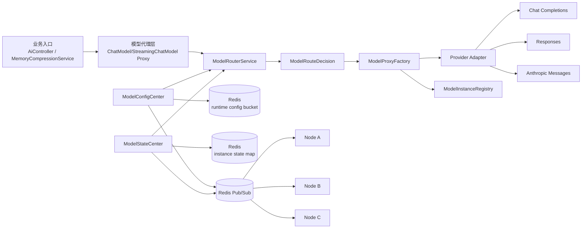
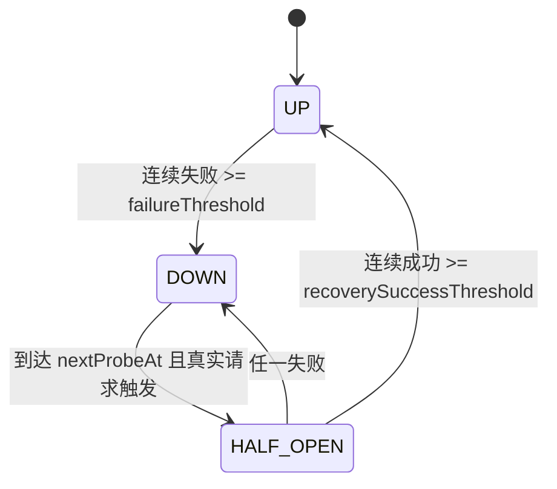

# 模型（Model）管理框架设计文档

## 1. 需求背景

现有系统已具备 Prompt 管理与热更新机制，但模型侧仍以静态 Bean 方式装配，无法满足以下诉求：

- 按语言（zh/en/ja）与场景（聊天、情景分析、记忆提取）进行多维路由
- 多实例运行时状态共享（健康度、QPS、延迟、可用性）
- tier 级固定策略与有序故障回退（轮询、最低延迟、权重随机、故障转移）
- 零额外探针的被动监控与故障恢复
- 多节点间秒级状态一致性

为此在现有 Prompt 管理模式基础上，新增统一的模型治理层，实现“schema v2 配置驱动 + 运行时动态决策 + Redis 共享状态”。

## 2. 总体架构


```mermaid
flowchart LR
    A[业务入口<br/>AiController / MemoryCompressionService] --> B[模型代理层<br/>ChatModel/StreamingChatModel Proxy]
    B --> C[ModelRouterService]
    C --> D[ModelRouteDecision]
    D --> E[ModelProxyFactory]
    E --> F[Provider Adapter]
    F --> M1[Chat Completions]
    F --> M2[Responses]
    F --> M3[Anthropic Messages]
    Config[ModelConfigCenter] --> C
    Config --> R1[(Redis<br/>runtime config bucket)]
    State[ModelStateCenter] --> C
    State --> R2[(Redis<br/>instance state map)]
    Config --> P[(Redis Pub/Sub)]
    State --> P
    P --> N1[Node A]
    P --> N2[Node B]
    P --> N3[Node C]
    E --> Registry[ModelInstanceRegistry]
```

## 3. 核心数据模型

### 3.1 配置模型（YAML -> Properties）

- `ModelRoutingProperties`
  - `schemaVersion`: 固定为 `2`
  - `models[]`: 物理模型注册表（provider/protocol/endpoint/key/model/能力/上下文/价格）
  - `tiers{}`: 逻辑模型层级（成员列表、选择策略、能力边界）
  - `routes[]`: 语言、场景、风险、预算与 fallback tier 规则
  - `defaultRoute`: 未命中特定规则时使用的默认路由

### 3.2 运行时模型

- `ModelInstance`: 逻辑实例对象，封装 `ChatModel` 与 `StreamingChatModel`
- `ModelRuntimeState`: 实时指标快照
  - `available`, `healthScore`, `qps`, `avgLatencyMs`, `errorRate`
  - `total/success/failureRequests`
  - `consecutiveFailures`, `consecutiveSuccesses`
  - `phase(UP/HALF_OPEN/DOWN)`, `nextProbeAt`, `lastError`
- `ModelStateEvent`: 状态广播事件
- `ModelRouteDecision`: 请求级不可变候选链和路由原因
- `ModelCallTrace`: 每一次调用尝试的低敏审计元数据

### 3.3 Redis Key Schema

| Key | Type | 说明 |
|---|---|---|
| `yusi:model:state:instances` | Hash | `field=instanceId`，`value=ModelRuntimeState` |
| `yusi:model:state:channel` | Pub/Sub Channel | 广播实例状态变化 |
| `yusi:model:runtime:config` | String | 当前 schema v2 全量运行配置 |
| `yusi:model:config:channel` | Pub/Sub Channel | 广播 schema v2 配置快照 |

## 4. 配置规范（YAML 示例）

```yaml
model:
  routing:
    schema-version: 2
    default-language: zh
    default-scene: chat
    default-tier: chat-balanced
    default-route:
      id: default
      language: '*'
      scene: '*'
      primary-tier: chat-balanced
      fallback-tiers: [chat-fast]
      priority: 0
    failure-threshold: 3
    recovery-success-threshold: 2
    recovery-probe-interval-ms: 15000
    models:
      - id: chat-completions-model
        display-name: Chat Completions model
        provider: openai-compatible
        protocol: CHAT_COMPLETIONS
        baseurl: ${CHAT_MODEL_BASEURL}
        apikey: ${CHAT_MODEL_APIKEY}
        model: ${CHAT_MODEL_NAME}
        context-window-tokens: ${CHAT_MODEL_CONTEXT_WINDOW_TOKENS}
        weight: 100
        priority: 1
        languages: [zh, en, ja]
        scenes: [chat, situation-analysis, memory-extract]
      - id: responses-model
        display-name: Responses model
        provider: openai-compatible
        protocol: RESPONSES
        baseurl: ${RESPONSES_MODEL_BASEURL}
        apikey: ${RESPONSES_MODEL_APIKEY}
        model: ${RESPONSES_MODEL_NAME}
        capabilities: [CHAT, STREAMING_CHAT]
      - id: anthropic-model
        display-name: Anthropic Messages model
        provider: anthropic
        protocol: ANTHROPIC_MESSAGES
        baseurl: ${ANTHROPIC_BASEURL:https://api.anthropic.com}
        apikey: ${ANTHROPIC_APIKEY}
        model: ${ANTHROPIC_MODEL}
        capabilities: [CHAT, STREAMING_CHAT]
    tiers:
      chat-fast:
        display-name: Fast
        strategy: LEAST_LATENCY
        members: [chat-completions-model]
        capabilities: [CHAT, STREAMING_CHAT]
      chat-balanced:
        display-name: Balanced
        strategy: FAIL_OVER
        members: [responses-model, anthropic-model]
        capabilities: [CHAT, STREAMING_CHAT]
    routes:
      - id: zh-chat
        language: zh
        scene: chat
        risk-level: LOW
        primary-tier: chat-balanced
        fallback-tiers: [chat-fast]
        max-input-tokens: 12000
        max-output-tokens: 512
        enabled: true
        priority: 100
```

### 4.1 预算与上下文准入

请求进入 Provider 之前，Gateway 会基于 `ChatRequest` 做保守的输入 Token 估算，覆盖文本消息、工具名称与参数以及图片占位成本。路由决策把估算输入、route 的 `max-input-tokens`、route 的输出上限和模型的 `context-window-tokens` 一起用于候选过滤：主 tier 容量不足时，只有满足预算的 fallback tier 才能进入 attempt 链。

route 未声明 `max-output-tokens` 或 `max-completion-tokens` 时，系统按 1024 token 预留输出空间。估算器不替代供应商 tokenizer；Provider 返回的真实 usage 仍是成本、审计和后续对账的唯一依据。没有配置模型 `context-window-tokens` 时不会凭空猜测供应商窗口，仍会执行 route 的显式输入上限。

## 5. 状态机流转图（被动监控）


```mermaid
stateDiagram-v2
    [*] --> UP
    UP --> DOWN: 连续失败 >= failureThreshold
    DOWN --> HALF_OPEN: 到达 nextProbeAt 且真实请求触发
    HALF_OPEN --> UP: 连续成功 >= recoverySuccessThreshold
    HALF_OPEN --> DOWN: 任一失败
```

## 6. 选择策略算法伪代码

### 6.1 Round-Robin

```text
cursor = groupCursor[group]++
for i in [0..n):
  candidate = list[(cursor + i) % n]
  if candidate.available:
    return candidate
return list[cursor % n]
```

### 6.2 Least-Latency

```text
available = filter(list, available == true)
if available is empty: return first(list)
return argmin(available, avgLatencyMs)
```

### 6.3 Weighted-Random

```text
available = filter(list, available == true)
if available is empty: return first(list)
sum = Σ max(1, weight)
r = random(0, sum)
scan cumulative weight and return first cumulative > r
```

### 6.4 Fail-Over

```text
ordered = sortByPriorityAsc(list)
for candidate in ordered:
  if candidate.available:
    return candidate
return first(ordered)
```

## 7. 异常处理与降级策略

- 路由降级
  - `language+scene` 未命中时，使用 `defaultRoute`
  - primary tier 无可用候选时，按 `fallback-tiers` 顺序继续尝试
- 故障降级
  - 实例连续失败触发 `DOWN`，选择层自动剔除
  - `DOWN` 状态仅在恢复窗口到达后由真实流量触发探测
- 恢复策略
  - `HALF_OPEN` 成功达到阈值后自动恢复 `UP`
  - `HALF_OPEN` 一次失败立即回落 `DOWN`
- 一致性保障
  - 配置快照和状态变更分别写入 Redis 并通过对应 Pub/Sub channel 广播
  - 各节点订阅事件并更新本地缓存，实现秒级收敛

## 8. 运行时配置发布能力

通过治理控制台可在运行时发布完整 schema v2 配置，无需重启：

- `GET /api/model/console`
- `PUT /api/model/console`
- `POST /api/model/routes/preview`
- `GET /api/model/states`

配置发布流程：

1. 读取 active MySQL 快照并校验 `expectedVersion`
2. 校验模型、tier、route 引用，合并未修改的服务端密钥
3. 保存下一版本快照和脱敏审计
4. 写入 `yusi:model:runtime:config` 并发布 `yusi:model:config:channel`
5. Redis 成功后替换本地配置并重载模型实例

## 9. SQL 落地与执行说明

### 9.1 新增表

- `model_runtime_config`
  - 作用：持久化模型治理运行时全量配置（JSON）
  - 关键字段：`config_key`、`config_json`、`version`、`updated_at`
- `model_config_change_log`
  - 作用：记录配置更新、回滚和失败原因等治理动作
  - 关键字段：`change_id`、`action`、`before_json`、`after_json`、`success`

### 9.2 脚本位置

- 全量初始化脚本：`docs/sql/init.sql`
- 增量变更脚本：`docs/sql/update_model_management.sql`

### 9.3 执行顺序

1. 新环境：直接执行 `init.sql`
2. 存量环境：先备份，再执行 `update_model_management.sql`
3. 执行完成后验证：
   - 表存在：`model_runtime_config`、`model_config_change_log`
   - 索引存在：`uk_model_runtime_config_key`、`uk_model_config_change_log_change_id`

### 9.4 与 Redis 控制面的关系

- Redis 仍是实时控制面（低延迟读写、秒级广播）
- MySQL 承担持久化与审计职责（可追溯、可恢复）
- 推荐策略：
  - 配置更新时先写 MySQL，再写 Redis 并广播
  - 节点启动时优先读取 Redis，必要时回补 MySQL 基线

## 10. v2 治理控制面

schema v2 将模型治理拆成四层：

1. `models[]` 是物理模型注册表，包含 provider、endpoint、能力、上下文窗口和价格快照。
2. `tiers{}` 是逻辑模型层级，场景规则只引用 tier ID，不引用供应商真实模型名。
3. `routes[]` 是按语言、场景、风险级别和优先级排序的固定策略，可声明有序 fallback tiers。
4. `ModelRouteDecision` 在首次 Provider 调用前固定候选链；每一次模型尝试单独写入 `ModelCallTrace`。

管理员主入口是路由矩阵和策略编辑器，模型注册表负责模型及 tier 成员选择，候选链预览只计算决策而不会发起模型调用。导出的 JSON 始终是当前 schema v2 快照，不提供旧格式转换或旧 endpoint。

### 10.1 版本化发布顺序

`PUT /api/model/console` 必须携带 `expectedVersion`。服务端按以下顺序执行：

1. 读取 active MySQL 快照并比较版本，过期版本返回 `CONFIG_VERSION_CONFLICT`。
2. 校验 schema v2 的 tier/route/model 引用并合并未修改的服务端密钥。
3. 保存下一版本全量快照和脱敏审计记录。
4. 写 Redis runtime bucket 并发布配置事件。
5. Redis 成功后才替换本地 `AtomicReference`，触发模型实例注册表重载。

Redis 发布失败时不替换本地配置，并追加失败审计记录。密钥不出现在治理 DTO、调用轨迹、路由预览或审计 JSON 中。

### 10.2 调用轨迹与指标

`model_call_trace` 只记录请求 ID、策略版本、路由原因、tier、模型、provider、usage、延迟、成本、错误分类和 fallback 标志。轨迹查询支持时间、场景、语言、tier、provider、模型、fallback 和状态过滤；不保存 prompt、回答、思维链或工具参数。

第一版只实现固定规则、健康过滤、错误分类 fallback 和 token/成本统计。需要引入语义路由、学习路由或语义缓存时，必须先积累可回放轨迹并建立评测集。
