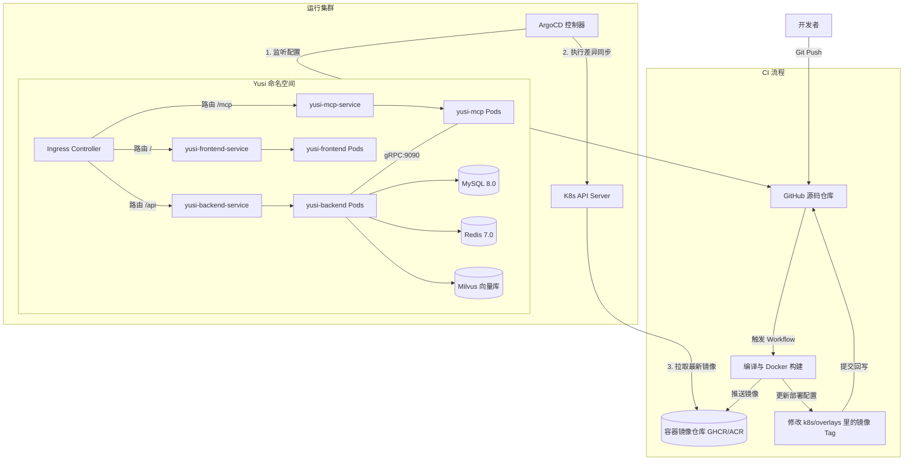

# Yusi 平台 Kubernetes 与 GitOps 运维方案

本方案旨在为 **Yusi (灵魂叙事)** 项目提供一套基于 Kubernetes (K8s) 和 GitOps 理念的现代运维架构方案。通过将部署配置声明式地托管在 Git 仓库中，并使用 ArgoCD 进行持续同步，实现高可用、无缝回滚、零停机发布以及完全自动化的 CI/CD 流程。

---

## 1. 核心设计理念与架构

### 1.1 为什么选择 K8s + GitOps？
当前基于 `SSH + docker-compose` 的单机部署存在以下痛点：
*   **服务中断**：容器重启时有短暂的服务不可用（没有蓝绿/滚动更新）。
*   **构建开销**：在生产服务器上拉取代码、编译 Maven 和 Node.js 会严重消耗服务器 CPU 与内存，影响线上运行。
*   **缺乏回滚与审计**：无法直观地知道当前运行的具体镜像版本，回滚需要手动干预，容易出错。

通过 K8s + GitOps，我们将获得：
1.  **Git 作为唯一事实源**：K8s 的所有资源定义（Deployments、Services、Ingress 等）全部以 YAML 形式托管在 Git。
2.  **声明式同步 (ArgoCD)**：集群内部的 ArgoCD 代理实时监听 Git 仓库的变更。一旦 Git 上的配置或镜像 Tag 更新，ArgoCD 会自动将集群状态调整为与 Git 一致。
3.  **零停机滚动更新**：K8s 自动管理 Pod 的生命周期，确保新版本 Pod 启动并健康检查通过后，才下线旧版本。
4.  **构建与运行分离**：所有的编译和 Docker 镜像构建工作在 GitHub Actions 中完成，并将镜像推送到镜像仓库（如阿里云 ACR、Docker Hub 或 GHCR），生产服务器仅拉取运行，实现零开销部署。

### 1.2 架构拓扑图



---

## 2. 部署目录结构设计

为了支持多环境（开发环境、生产环境）的配置隔离，我们引入 **Kustomize** 工具。Kustomize 是 K8s 原生支持的声明式配置工具，它避免了 Helm 复杂的模板语法，通过 `base` (基础模板) + `overlays` (环境差异包) 的形式管理配置。

```text
yusi/
├── k8s/                            # K8s 部署配置根目录
│   ├── base/                       # 基础配置（所有环境共用）
│   │   ├── kustomization.yaml      # 基础入口
│   │   ├── namespace.yaml          # 命名空间定义
│   │   ├── backend.yaml            # 后端 Deployment & Service
│   │   ├── frontend.yaml           # 前端 Deployment & Service
│   │   ├── mcp.yaml                # MCP 服务 Deployment & Service
│   │   ├── configmap.yaml          # 非敏感配置项
│   │   ├── secrets-template.yaml   # 敏感配置模板（不存真实密码）
│   │   └── ingress.yaml            # 网关路由配置
│   └── overlays/                   # 环境差异配置
│       ├── dev/                    # 开发/测试环境
│       │   ├── kustomization.yaml  # 继承 base 并修改副本数/域名
│       │   ├── map-keys-patches.yaml# 环境变量覆盖
│       │   └── secrets.yaml        # 开发敏感配置（在集群中直接创建或使用密文工具）
│       └── prod/                   # 生产环境
│           ├── kustomization.yaml  # 继承 base 并修改为生产域名
│           ├── replicas-patches.yaml# 生产高可用副本数调整
│           └── secrets.yaml        # 生产敏感配置
```

---

## 3. Kubernetes 核心资源清单设计

### 3.1 命名空间与基础配置

在 `k8s/base/namespace.yaml` 中定义独立命名空间，实现资源隔离：

```yaml
apiVersion: v1
kind: Namespace
metadata:
  name: yusi
```

### 3.2 敏感数据 (Secrets) 与配置项 (ConfigMap)
在 K8s 中，非敏感的环境变量（如 base_url 等）配置在 ConfigMap 中，而敏感的数据（如数据库密码、AI API Key 等）存储在 Secret 中。

**基础 ConfigMap (`k8s/base/configmap.yaml`)**：
```yaml
apiVersion: v1
kind: ConfigMap
metadata:
  name: yusi-config
  namespace: yusi
data:
  # 运行配置文件激活
  SPRING_PROFILES_ACTIVE: "prod"
  # 模型基础配置
  EMBEDDING_MODEL_NAME: "BAAI/bge-m3"
  EMBEDDING_MODEL_DIMENSION: "1024"
  CHAT_MODEL_NAME: "deepseek-chat"
  # 数据库连接
  MYSQL_HOST: "mysql-service.infra.svc.cluster.local"
  MYSQL_PORT: "3306"
  MYSQL_DB: "yusi"
  # 缓存与向量库
  REDIS_HOST: "redis-service.infra.svc.cluster.local"
  REDIS_PORT: "6379"
  MILVUS_HOST: "milvus-service.infra.svc.cluster.local"
  MILVUS_PORT: "19530"
```

**敏感 Secrets 模板 (`k8s/base/secrets-template.yaml`)**：
> [!IMPORTANT]
> 真实的秘钥文件绝对不可直接提交到公开的 Git 仓库。生产环境中推荐使用 **Sealed Secrets**（Bitnami 方案，可将加密后的密文安全提交到 Git），或者在集群中通过命令行直接创建 `kubectl create secret generic yusi-secret ...`。

```yaml
apiVersion: v1
kind: Secret
metadata:
  name: yusi-secret
  namespace: yusi
type: Opaque
stringData:
  # 数据库密码
  MYSQL_PASSWORD: "YOUR_REAL_PASSWORD"
  # AI 模型秘钥
  CHAT_MODEL_APIKEY: "sk-xxxx"
  EMBEDDING_MODEL_APIKEY: "sk-xxxx"
  # 日记 AES 加密密钥 (32 字节 Base64)
  YUSI_ENCRYPTION_KEY: "your-32-byte-base64-key"
```

### 3.3 后端微服务部署配置 (`k8s/base/backend.yaml`)
包含健康检查（Probes）、生命周期滚动策略、资源配额限制以及优雅下线。

```yaml
apiVersion: apps/v1
kind: Deployment
metadata:
  name: yusi-backend
  namespace: yusi
spec:
  replicas: 2
  strategy:
    type: RollingUpdate
    rollingUpdate:
      maxSurge: 1       # 滚动更新期间允许创建的最大超额 Pod 数量
      maxUnavailable: 0 # 滚动更新期间不允许出现不可用的 Pod 数量，确保零停机
  selector:
    matchLabels:
      app: yusi-backend
  template:
    metadata:
      labels:
        app: yusi-backend
    spec:
      containers:
      - name: backend
        image: yusi-backend:latest
        imagePullPolicy: Always
        ports:
        - containerPort: 20611
          name: http
        - containerPort: 9090
          name: grpc
        # 环境变量注入
        envFrom:
        - configMapRef:
            name: yusi-config
        env:
        # 将 Secret 中的敏感字段单独注入为环境变量
        - name: SPRING_DATASOURCE_PASSWORD
          valueFrom:
            secretKeyRef:
              name: yusi-secret
              key: MYSQL_PASSWORD
        - name: CHAT_MODEL_APIKEY
          valueFrom:
            secretKeyRef:
              name: yusi-secret
              key: CHAT_MODEL_APIKEY
        - name: EMBEDDING_MODEL_APIKEY
          valueFrom:
            secretKeyRef:
              name: yusi-secret
              key: EMBEDDING_MODEL_APIKEY
        - name: YUSI_ENCRYPTION_KEY
          valueFrom:
            secretKeyRef:
              name: yusi-secret
              key: YUSI_ENCRYPTION_KEY
        # 动态组装连接串
        - name: SPRING_DATASOURCE_URL
          value: "jdbc:mysql://$(MYSQL_HOST):$(MYSQL_PORT)/$(MYSQL_DB)?useUnicode=true&characterEncoding=utf8&autoReconnect=true&zeroDateTimeBehavior=convertToNull&serverTimezone=UTC&useSSL=false"
        - name: REDIS_SDK_CONFIG_HOST
          value: "$(REDIS_HOST)"
        - name: REDIS_SDK_CONFIG_PORT
          value: "$(REDIS_PORT)"
        # 资源限制
        resources:
          requests:
            cpu: "500m"
            memory: "1Gi"
          limits:
            cpu: "2000m"
            memory: "2Gi"
        # 健康检查（结合 Spring Boot Actuator）
        livenessProbe:
          httpGet:
            path: /actuator/health/liveness
            port: 20611
          initialDelaySeconds: 45
          periodSeconds: 15
        readinessProbe:
          httpGet:
            path: /actuator/health/readiness
            port: 20611
          initialDelaySeconds: 30
          periodSeconds: 10
        # 优雅下线：给容器留足时间处理完当前的 HTTP 请求
        lifecycle:
          preStop:
            exec:
              command: ["/bin/sh", "-c", "sleep 15"]
---
apiVersion: v1
kind: Service
metadata:
  name: yusi-backend
  namespace: yusi
spec:
  ports:
  - port: 20611
    targetPort: 20611
    name: http
  - port: 9090
    targetPort: 9090
    name: grpc
  selector:
    app: yusi-backend
```

### 3.4 MCP 服务部署配置 (`k8s/base/mcp.yaml`)

```yaml
apiVersion: apps/v1
kind: Deployment
metadata:
  name: yusi-mcp
  namespace: yusi
spec:
  replicas: 1
  selector:
    matchLabels:
      app: yusi-mcp
  template:
    metadata:
      labels:
        app: yusi-mcp
    spec:
      containers:
      - name: mcp
        image: yusi-mcp:latest
        ports:
        - containerPort: 11611
          name: http
        env:
        - name: GIN_MODE
          value: "release"
        # 直接使用 K8s 内部 Service 域名进行 gRPC 通信
        - name: GRPC_BACKEND_TARGET
          value: "yusi-backend.yusi.svc.cluster.local:9090"
        resources:
          requests:
            cpu: "100m"
            memory: "128Mi"
          limits:
            cpu: "500m"
            memory: "512Mi"
        livenessProbe:
          httpGet:
            path: /health
            port: 11611
          initialDelaySeconds: 10
          periodSeconds: 20
        readinessProbe:
          httpGet:
            path: /health
            port: 11611
          initialDelaySeconds: 5
          periodSeconds: 10
---
apiVersion: v1
kind: Service
metadata:
  name: yusi-mcp
  namespace: yusi
spec:
  ports:
  - port: 11611
    targetPort: 11611
    name: http
  selector:
    app: yusi-mcp
```

### 3.5 前端部署配置 (`k8s/base/frontend.yaml`)

前端通过 Nginx 运行，Nginx 内部代理转发 `/api/` 接口给后端。在 K8s 中，我们同样将高德地图 Key 通过环境变量注入到 Frontend Pod。

```yaml
apiVersion: apps/v1
kind: Deployment
metadata:
  name: yusi-frontend
  namespace: yusi
spec:
  replicas: 2
  selector:
    matchLabels:
      app: yusi-frontend
  template:
    metadata:
      labels:
        app: yusi-frontend
    spec:
      containers:
      - name: frontend
        image: yusi-frontend:latest
        ports:
        - containerPort: 8080
          name: http
        env:
        # 高德地图 API 配置
        - name: AMAP_JS_KEY
          valueFrom:
            secretKeyRef:
              name: yusi-secret
              key: AMAP_JS_KEY
        - name: AMAP_SECURITY_CODE
          valueFrom:
            secretKeyRef:
              name: yusi-secret
              key: AMAP_SECURITY_CODE
        resources:
          requests:
            cpu: "100m"
            memory: "128Mi"
          limits:
            cpu: "300m"
            memory: "256Mi"
        livenessProbe:
          httpGet:
            path: /
            port: 8080
          initialDelaySeconds: 10
          periodSeconds: 20
---
apiVersion: v1
kind: Service
metadata:
  name: yusi-frontend
  namespace: yusi
spec:
  ports:
  - port: 8080
    targetPort: 8080
    name: http
  selector:
    app: yusi-frontend
```

### 3.6 网关网关入口 Ingress (`k8s/base/ingress.yaml`)
利用 K8s Ingress（例如 Nginx Ingress Controller）作为集群 Newell 入口，分配公网 IP，配置 SSL 证书并转发流量。

```yaml
apiVersion: networking.k8s.io/v1
kind: Ingress
metadata:
  name: yusi-ingress
  namespace: yusi
  annotations:
    kubernetes.io/ingress.class: "nginx"
    nginx.ingress.kubernetes.io/proxy-body-size: "50m"
    # 开启 SSL 重定向
    nginx.ingress.kubernetes.io/ssl-redirect: "true"
spec:
  rules:
  - host: yusi.yourdomain.com
    http:
      paths:
      # 前端路由
      - path: /
        pathType: Prefix
        backend:
          service:
            name: yusi-frontend
            port:
              number: 8080
      # 后端 API 路由
      - path: /api
        pathType: Prefix
        backend:
          service:
            name: yusi-backend
            port:
              number: 20611
      # MCP 接口路由
      - path: /mcp
        pathType: Prefix
        backend:
          service:
            name: yusi-mcp
            port:
              number: 11611
  tls:
  - hosts:
    - yusi.yourdomain.com
    secretName: yusi-tls-cert # 存有 SSL 证书的 Secret
```

---

## 4. GitOps 自动化流水线 (CI/CD) 设计

为了实现持续交付，当我们将代码合入主分支后，应该自动触发构建并更新 K8s 部署配置。

### 4.1 GitHub Actions 流水线定义

我们将在 `.github/workflows/deploy_k8s.yml` 中实现：
1.  **后端 Java 编译** 并打包。
2.  **前端 Vite 构建**。
3.  使用 Docker **构建三端镜像** 并推送到容器镜像仓库。
4.  **自动修改 Kustomize 配置**：利用 `kustomize edit set image` 将 `dev` 或 `prod` 环境的镜像 Tag 更改为本次 Commit 的 Git SHA。
5.  **提交回写 Git**：Actions 自动把新 Tag 的配置 Push 到 Git 仓库。

> [!TIP]
> 这种「代码库」与「配置库」在同一个 Monorepo 中的做法适合中小项目。当项目规模扩大时，可以把 `k8s/` 目录挪到专用的 `yusi-gitops-infra` 仓库，防止 CI 回写触发无限循环构建。

```yaml
name: K8s GitOps Build & Push

on:
  push:
    branches:
      - main # 合并到主分支时触发

permissions:
  contents: write # 赋予 Workflow 回写 Git 仓库的权限

jobs:
  build-and-deploy:
    runs-on: ubuntu-latest
    steps:
    - name: Checkout Code
      uses: actions/checkout@v4

    # 1. 登录容器镜像服务 (例如阿里云 ACR 或 GitHub GHCR)
    - name: Login to GHCR
      uses: docker/login-action@v3
      with:
        registry: ghcr.io
        username: ${{ github.actor }}
        password: ${{ secrets.GITHUB_TOKEN }}

    # 2. 设置 JDK 并编译 Java 后端
    - name: Set up JDK 21
      uses: actions/setup-java@v4
      with:
        java-version: '21'
        distribution: 'temurin'
        cache: 'maven'
        
    - name: Build Java Backend
      run: ./mvnw clean package -DskipTests

    # 3. 设置 Node 并编译前端 (利用 Docker 多阶段构建，这一步可以直接合并在 Dockerfile 中，或在此编译减少 Docker层大小)
    # 本处我们直接采用 Dockerfile 内部的多阶段构建，避免宿主机环境污染

    # 4. 构建并推送镜像 (使用 Git Commit SHA 作为 Version Tag)
    - name: Build and Push Backend Image
      uses: docker/build-push-action@v5
      with:
        context: .
        file: Dockerfile
        push: true
        tags: |
          ghcr.io/${{ github.repository }}/yusi-backend:${{ github.sha }}
          ghcr.io/${{ github.repository }}/yusi-backend:latest

    - name: Build and Push Frontend Image
      uses: docker/build-push-action@v5
      with:
        context: ./frontend
        file: ./frontend/Dockerfile
        push: true
        tags: |
          ghcr.io/${{ github.repository }}/yusi-frontend:${{ github.sha }}
          ghcr.io/${{ github.repository }}/yusi-frontend:latest

    - name: Build and Push MCP Image
      uses: docker/build-push-action@v5
      with:
        context: ./mcp
        file: ./mcp/Dockerfile
        push: true
        tags: |
          ghcr.io/${{ github.repository }}/yusi-mcp:${{ github.sha }}
          ghcr.io/${{ github.repository }}/yusi-mcp:latest

    # 5. 更新 GitOps 配置 (使用 Kustomize 替换 overlay 的镜像)
    - name: Set up Kustomize
      uses: imranismail/setup-kustomize@v2

    - name: Update K8s Manifest Image Tag
      run: |
        cd k8s/overlays/prod
        kustomize edit set image yusi-backend=ghcr.io/${{ github.repository }}/yusi-backend:${{ github.sha }}
        kustomize edit set image yusi-frontend=ghcr.io/${{ github.repository }}/yusi-frontend:${{ github.sha }}
        kustomize edit set image yusi-mcp=ghcr.io/${{ github.repository }}/yusi-mcp:${{ github.sha }}

    # 6. 提交修改并推回 Git 仓库
    - name: Commit and Push Manifest Changes
      run: |
        git config --global user.name "github-actions[bot]"
        git config --global user.email "github-actions[bot]@users.noreply.github.com"
        git add k8s/overlays/prod/kustomization.yaml
        git commit -m "chore(gitops): update image tags to ${{ github.sha }} [skip ci]"
        git push origin main
```

---

## 5. GitOps 引擎 (ArgoCD) 部署与集成

### 5.1 ArgoCD 安装
在 K8s 集群中，使用以下官方命令一键安装 ArgoCD：

```bash
kubectl create namespace argocd
kubectl apply -n argocd -f https://raw.githubusercontent.com/argoproj/argo-cd/stable/manifests/install.yaml
```

### 5.2 创建 ArgoCD 声明式应用 (Application CRD)
在集群中应用以下清单，ArgoCD 将自动建立与 Git 仓库的连接，并把 `overlays/prod` 目录的内容同步至集群的 `yusi-prod` 命名空间。

```yaml
apiVersion: argoproj.io/v1alpha1
kind: Application
metadata:
  name: yusi-app-prod
  namespace: argocd
spec:
  project: default
  source:
    repoURL: 'https://github.com/Aseubel/yusi-infra.git' # 基础设施仓库地址
    targetRevision: HEAD                                 # 监控的分支
    path: overlays/prod                                  # 监控的 K8s 配置文件目录
  destination:
    server: 'https://kubernetes.default.svc'             # 目标集群
    namespace: yusi-prod                                 # 部署的命名空间
  syncPolicy:
    automated:
      prune: true                                        # 自动删除 Git 中已被删除的资源
      selfHeal: true                                     # 自动修复外部对资源的篡改
    syncOptions:
      - CreateNamespace=true                             # 如果命名空间不存在则自动创建
```

---

## 6. 生产高级运维规范与建议

1.  **数据库迁移管理 (Schema Migrations)**:
    不要依赖 JPA 的 `ddl-auto: update` 进行生产数据库变更。建议在后端代码中引入 **Flyway** 或 **Liquibase**。在 K8s Pod 启动时，InitContainer 会先执行 SQL 升级，升级成功后后端业务主容器再启动。
2.  **滚动更新中的优雅停机 (Graceful Shutdown)**:
    Spring Boot 配置中应添加 `server.shutdown: graceful`。同时 K8s Pod 设置 `preStop` 钩子 `sleep 15`，让 K8s 有足够时间将该 Pod 从 Service 负载均衡的后端终结点（Endpoints）中摘除，然后再由 Spring Boot 处理完存量连接。
3.  **日志收集与监控**:
    删除 `docker-compose.yml` 中的本地文件日志挂载。在 K8s 中，所有 Pod 的日志直接输出至标准输出（Stdout / Stderr），由集群统一的 **Loki / EFK** 收集。监控指标（Metrics）通过在后端开启 Actuator Prometheus 端口，由 **Prometheus + Grafana** 定时拉取并展示。
4.  **CPU / 内存超限防护**:
    务必配置 `resources.limits`。Java 启动参数需加入 `-XX:MaxRAMPercentage=75.0`，使 JVM 能够自动感知容器的内存上限，避免出现容器内存达到 100% 触发宿主机内核 OOM Killer 强杀 Java 进程的情况。

---

## 7. 服务器配置与硬件估算 (不含 Milvus)

将 **Milvus 数据库移除本地物理服务器**（采用云端 SaaS 服务如 Zilliz，或部署在另外独立的服务器）是非常明智的决策，因为 Milvus 在进行向量索引构建和检索时，对内存和 CPU 的消耗极大（常规需要 8GB+ RAM）。

移除 Milvus 后，我们需要承载的组件包括：**K8s 集群控制面、ArgoCD 引擎、Yusi 三端应用（前端、后端、MCP）以及 MySQL 和 Redis 中间件**。

### 7.1 组件资源占用估算 (运行期峰值/健康配额)

| 组件类别 | 实例/副本数 | CPU (典型/峰值占用) | 内存 (分配配额/典型消耗) | 说明 |
| :--- | :--- | :--- | :--- | :--- |
| **K8s 集群底座 (如 k3s)** | 1 | 0.5 - 1.0 核 | 1.0 - 1.5 GiB | API Server, Kubelet, Flannel 基础消耗 |
| **ArgoCD 引擎** | 1 套 | 0.2 - 0.5 核 | 1.0 - 1.5 GiB | 负责 GitOps 自动同步，轻量级运行 |
| **yusi-backend (Java 21)** | 2 (高可用) | 0.5 - 2.0 核 | 2.0 GiB (单个 Pod 分配 1.0 GiB) | Spring Boot 应用内存占用大，需预留安全余量 |
| **yusi-frontend (Nginx)** | 2 (高可用) | 0.1 - 0.2 核 | 0.25 GiB (单个 Pod 分配 128 MiB) | 静态页面分发，开销极小 |
| **yusi-mcp (Go)** | 1 | 0.1 - 0.3 核 | 0.25 GiB | Go 进程，高并发但资源占用极低 |
| **MySQL 8.0** | 1 (容器化) | 0.5 - 1.5 核 | 1.5 - 2.0 GiB | 读写密集，需要给 Buffer Pool 预留内存 |
| **Redis 7.0** | 1 (容器化) | 0.1 - 0.5 核 | 0.5 GiB | 缓存与分布式锁，内存按数据量增加 |
| **系统预留 (Buffer)** | - | 0.5 核 | 1.0 GiB | 应对日志收集、系统升级与偶发性流量突增 |
| **理论最低合计需求** | - | **约 3.5 - 5.5 核** | **约 7.5 - 9.0 GiB** | 理论运行所需的最低安全硬件基础 |

### 7.2 物理服务器规格与选型方案

#### 方案 A：单机版 K8s 极简部署 (最省钱，适合前期冷启动 / 开发测试)
*   **架构**：单台云服务器，通过 **k3s** 部署单节点 K8s，MySQL、Redis 和应用全部放在里面。
*   **云服务器规格**：**4核 16G** (如阿里云通用型 g7/g8，或腾讯云标准型 S5/S6)。
    *   *为什么不用 4核 8G？* 4核8G 的物理内存在扣除 Linux 系统内核及 K8s 本身占用的 2-3G 后，只剩下 5G 左右，运行 JVM、MySQL、Redis 和 ArgoCD 会非常拥挤，容易因内存不足触发宿主机 OOM。
*   **云盘配置**：**100 GB ESSD / SSD** (系统盘 40G + 数据盘 60G，挂载给 MySQL 作持久化并存储 Docker 镜像)。
*   **网络带宽**：**3M - 5M** 按带宽计费，或采用**按流量计费 (100M 峰值)**。

#### 方案 B：高可用生产标准版 (推荐，生产稳定性首选)
为了保障生产环境下的高可用性，防止单台云服务器死机导致业务完全停摆，建议将「计算（应用）」与「状态（数据库）」分离：
1.  **云托管关系型数据库 (RDS MySQL)**：**2核 4G** (独享版)。免去容器化部署数据库的运维开销，支持自动备份和多可用区容灾。
2.  **云托管 Redis**：**1G / 2G** 主从版。
3.  **K8s 工作节点 (ECS)**：**2 台 4核 8G** 云服务器。
    *   在两台不同的服务器上分布式部署 `yusi-backend` (2副本) 和 `yusi-frontend` (2副本)。
    *   当其中任意一台服务器发生物理故障或死机时，K8s 能够自动将受影响的 Pod 重建并调度到健康的另一台服务器上，Ingress 自动切流，实现业务**零停机**。

