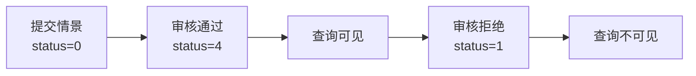

# Yusi 测试报告

---

## 1. 测试概况

| 类别 | 数量 | 说明 |
|:---|:---|:---|
| 单元测试 | 3 | SoulPlazaServiceImpl 情感过滤逻辑 |
| 集成测试 | 1 | 情景室提交与审核流程 |
| 工具测试 | 1 | 压缩工具正则匹配 |
| 手动测试 | - | 核心流程验证 |

---

## 2. 主要测试用例

### 2.1 单元测试：广场 Feed 情感过滤

**测试类**：`SoulPlazaTest.java`

| 用例 | 输入 | 预期行为 |
|:---|:---|:---|
| 情感筛选 | emotion="Joy" | 调用 findByUserIdNotAndEmotionOrderByCreatedAtDesc |
| 全局展示 | emotion=null | 调用 findByUserIdNotOrderByCreatedAtDesc |
| 全局展示 | emotion="All" | 调用 findByUserIdNotOrderByCreatedAtDesc |

**结果**：✅ 3/3 通过

---

### 2.2 集成测试：情景室审核流程

**测试类**：`SituationScenarioTest.java`

**测试步骤**：
1. 用户提交情景 → status=0 (待审核)
2. 管理员审核通过 → status=4 (人工通过)
3. 查询列表 → 包含该情景
4. 管理员审核拒绝 → status=1 (人工拒绝)
5. 查询列表 → 不包含该情景

**结果**：✅ 通过

---

### 2.3 手动测试：核心流程

| 流程 | 测试结果 |
|:---|:---|
| 用户注册/登录 | ✅ |
| 日记加密存储 (DEFAULT 模式) | ✅ |
| 日记解密读取 | ✅ |
| 日记编辑 | ✅ |
| 广场发布与 Feed 加载 | ✅ |
| 共鸣功能 | ✅ |
| 灵魂匹配推荐 | ✅ |
| 情景室创建/加入 | ✅ |
| AI 聊天 (WebSocket) | ✅ |
| 图片上传 (OSS) | ✅ |
| 主题切换 (明/暗) | ✅ |

---

## 3. 技术指标

### 3.1 运行性能

| 指标 | 实测值 | 说明 |
|:---|:---|:---|
| 应用启动时间 | ~8s | Spring Boot 3.4.5 + Java 21 |
| API 平均响应时间 | <200ms | 本地测试 (不含 AI 调用) |
| 数据库连接池 | HikariCP 5-10 连接 | 生产可调 |
| 并发处理能力 | 200 线程 | Tomcat 配置 |

### 3.2 安全性

| 措施 | 状态 |
|:---|:---|
| JWT Token 认证 | ✅ RS256 签名 |
| 密码 BCrypt 存储 | ✅ |
| 日记 AES-GCM 加密 | ✅ |
| 端到端加密 (CUSTOM 模式) | ✅ |
| RSA-OAEP 密钥备份 | ✅ |
| 敏感词过滤 | ✅ DFA 算法 |
| SQL 注入防护 | ✅ JPA 参数化查询 |

### 3.3 扩展性

| 维度 | 设计 |
|:---|:---|
| AI 模型 | LangChain4j 多模型动态路由 |
| 存储 | ShardingSphere 分库分表支持 |
| 缓存 | Redis + Redisson 分布式锁 |
| 向量检索 | Milvus 支持 |
| MCP 协议 | gRPC 扩展接入外部 AI |

### 3.4 部署

| 指标 | 状态 |
|:---|:---|
| Docker 容器化 | ✅ docker-compose 一键部署 |
| 前端构建 | ✅ Vite + PWA 支持 |
| 环境隔离 | ✅ Spring Profiles (dev/test/prod) |

### 3.5 可用性

| 维度 | 状态 |
|:---|:---|
| 限流 | ✅ Redis 分布式限流 + Guava 降级 |
| 熔断 | ✅ 三级熔断状态机 (AI 模型) |
| 监控 | ✅ 模型运行时状态上报 |
| 日志 | ✅ Logback 结构化日志 |
| 国际化 | ✅ i18next (zh/en) |

---

## 4. 已知问题

| 问题 | 影响 | 状态 |
|:---|:---|:---|
| 前端单元测试 | 暂未引入 | 待补充 |
| 压力测试 | 未进行 | 建议生产前完成 |
| AI 模型性能基准 | 未建立 | 建议监控沉淀 |
