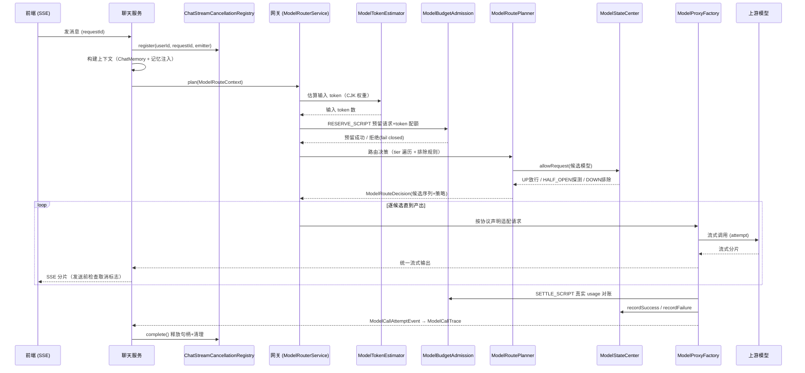
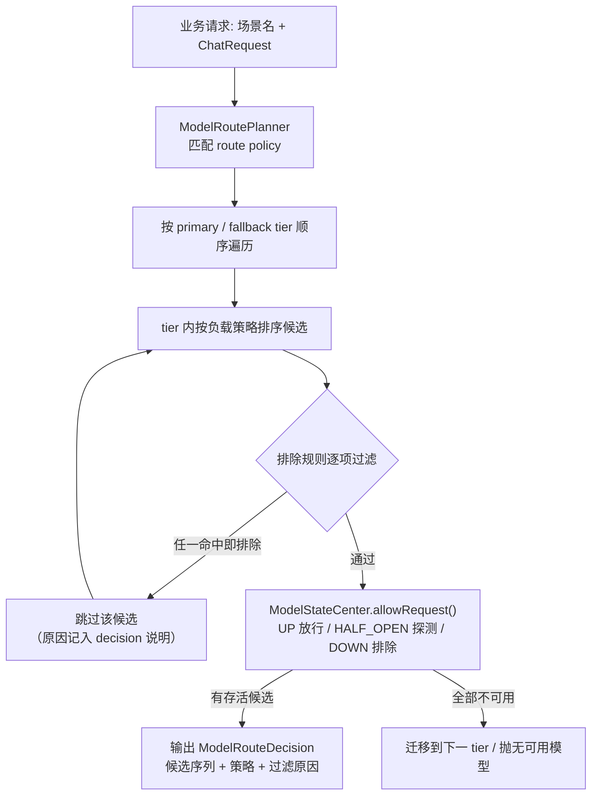
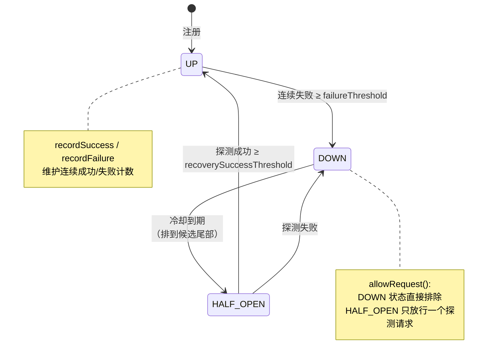
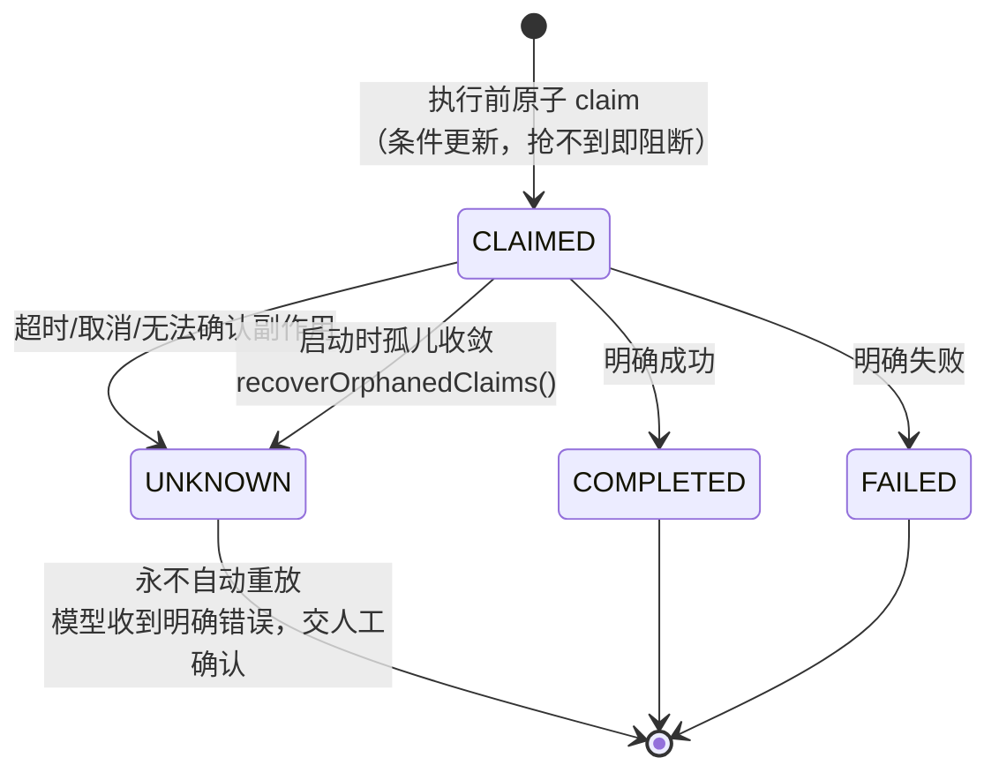

# 予思模型调用全链路设计文档

> 版本：v1.0 ｜ 姊妹篇：《记忆系统全链路设计.md》
> 覆盖范围：从业务发起一次 AI 调用，到路由、预算准入、协议适配、流式执行、取消、重试、幂等、Trace 的完整链路。
> 文中行号以当前代码版本为准，重构后请以类名/方法名为准。

---

## 1. 概述

模型调用全链路的核心思想：**业务代码只面对「场景名」，不面对具体模型**。业务方说"我要做情绪分析"，网关决定用哪个模型、走什么协议、花多少钱、失败了怎么办。

**设计目标：**

1. **可治理**：模型注册表 + 场景路由矩阵 + 配置版本化发布可回滚，业务与模型解耦
2. **成本可控**：Token 预算「估算 → 预留 → 对账 → 释放」，多维配额 fail closed
3. **故障自愈**：健康过滤 + DOWN 冷却 + 半开探测 + 多候选故障转移
4. **副作用安全**：写工具幂等账本，UNKNOWN 永不自动重放
5. **低敏可观测**：三层 Trace 贯穿，红线不存 prompt/回答/思考链

---

## 2. 一次流式聊天调用的全链路时序

---

## 3. 配置层

### 3.1 路由配置结构

**代码**：[ModelRoutingProperties.java](file:///d:/develop/Java/javacode/yusi/src/main/java/com/aseubel/yusi/config/ai/properties/ModelRoutingProperties.java)

- L17-51：根结构 `models / tiers / routes / defaultRoute` + 健康阈值（`failureThreshold`、`recoverySuccessThreshold`、`recoveryProbeIntervalMs`）
- L53-103：单模型定义 `ModelDefinition` —— provider、**protocol**、capabilities（能力声明）、weight、priority、scenes、timeout、`contextWindowTokens`、pricing

### 3.2 三层配置优先级：MySQL > Redis > YAML

| 层 | 角色 |
|---|---|
| YAML | 出厂默认，零配置可启动 |
| MySQL | **治理唯一事实源**：管理员控制台修改、版本化发布、可回滚（`ModelManagementService.createGovernanceDraft` 装配 models/tiers/routes 快照） |
| Redis | 启动与配置事件时写入的 canonical 快照，运行时热读取 |

关键语义：重启恢复以库中已发布版本为准（防过期 YAML 倒灌）；每次变更记录来源/版本/变更人；**启动时把最终生效配置全量摘要打日志**（多少模型、多少 tier、每个实例协议与能力），线上跑的什么配置一眼可见。

---

## 4. 路由决策

### 4.1 决策流程

**入口**：[ModelRouterService.plan()](file:///d:/develop/Java/javacode/yusi/src/main/java/com/aseubel/yusi/service/ai/model/ModelRouterService.java) L48-59 —— 从配置中心取生效配置，组装 tier 成员与运行时状态，委托规划器。
**候选集合**：同上 L61-99 —— tiers.members 映射为实际 `ModelInstance`（优先已注册实例，缺失时从 models 元数据构造）。

### 4.2 排除规则（不信任任何单一健康信号）

**代码**：[ModelRoutePlanner.java](file:///d:/develop/Java/javacode/yusi/src/main/java/com/aseubel/yusi/service/ai/model/ModelRoutePlanner.java) L169-211（L113-167 为 tier 内过滤主流程）

tier 禁用 / 模型未知或禁用 / **能力不匹配**（如 VLM 请求只路由到声明了 VLM 的模型）/ 场景不匹配 / 零权重 / 输入 token 超限 / 上下文窗口超限 / DOWN 或半开状态。

### 4.3 四种负载策略

| 策略 | 行为 | 适用场景 |
|---|---|---|
| `FAIL_OVER` | 按优先级稳定排序，当前模型没产出才切下一个 | 必须用最强模型的主备 |
| `ROUND_ROBIN` | tier 内独立游标轮询 | 同质模型均摊流量 |
| `LEAST_LATENCY` | 指数平均延迟升序，无样本先探索；老请求权重衰减 | 延迟敏感，防单次抖动永久拉黑 |
| `WEIGHTED_RANDOM` | 只从健康正权重成员随机，零权重永不选中 | 灰度 / 成本分层 |

发布前配置校验：权重非正、tier 循环引用、能力不满足场景的配置**直接拒绝生效**。

---

## 5. 健康治理状态机

**代码**：[ModelStateCenter.java](file:///d:/develop/Java/javacode/yusi/src/main/java/com/aseubel/yusi/service/ai/model/ModelStateCenter.java) L86-151

---

## 6. Token 预算准入（估算 → 预留 → 对账 → 释放）

**大模型调用无法同步扣费**（费用只有响应回来才知道），所以采用"先预留后对账"：

### 6.1 估算

**代码**：[ModelTokenEstimator.java](file:///d:/develop/Java/javacode/yusi/src/main/java/com/aseubel/yusi/service/ai/model/ModelTokenEstimator.java) L20-55

- 保守估算 `ChatRequest` 输入 token：按 message / tool 参数 / image 占位分别估（L57-125 含**中日韩 CJK 字符权重**逻辑）
- 输出上限：route 未配置时按 1024 预留
- 估算结果同时用于**上下文窗口过滤**（装不下的候选模型直接排除）

### 6.2 预留与对账（Redis Lua 原子脚本）

**代码**：[ModelBudgetAdmission.java](file:///d:/develop/Java/javacode/yusi/src/main/java/com/aseubel/yusi/service/ai/model/ModelBudgetAdmission.java)

| 步骤 | 脚本 | 位置 | 语义 |
|---|---|---|---|
| 预留 | `RESERVE_SCRIPT` | L105-149 | **原子**检查并预扣用户/模型/供应商三维的请求数+Token 固定窗口配额——多维桶要么全过要么全拒，不会出现过了 A 桶挂在 B 桶的中间态 |
| 对账 | `SETTLE_SCRIPT` | L157-203 | 真实 usage 回来后幂等对账，多退少补；响应丢失/断流按预留挂账，靠预留记录 TTL 兜底自动释放 |

**故障语义**：Redis 不可用时 fail closed 返回固定错误，**不放行**——预算准入的失败模式必须是"拒绝"而不是"超支"。

---

## 7. 协议适配与执行

**代码**：[ModelProxyFactory.java](file:///d:/develop/Java/javacode/yusi/src/main/java/com/aseubel/yusi/service/ai/model/ModelProxyFactory.java)

- L154-242：把统一 `ChatRequest` 适配为三种协议——**OpenAI Chat Completions / OpenAI Responses / Anthropic Messages**
- **协议由生效注册表里该模型的 protocol 声明决定，不由场景去猜**；Responses 协议输入需丢弃历史 thinking 和加密 reasoning，只保留文本/图片/工具调用等合法部分
- L442-469：调用选中模型的 streaming client，记录成功/失败状态；抛 `ModelInvocationException` 时**允许则切换到下一候选模型**（网关层故障转移，与业务重试解耦）
- 模型实例创建：[ModelInstanceRegistry.java](file:///d:/develop/Java/javacode/yusi/src/main/java/com/aseubel/yusi/service/ai/model/ModelInstanceRegistry.java) L50-85（校验 chat/streaming/VLM 能力后经 provider registry 创建客户端）

---

## 8. 流式执行与端到端取消

### 8.1 活跃请求注册表

**代码**：[ChatStreamCancellationRegistry.java](file:///d:/develop/Java/javacode/yusi/src/main/java/com/aseubel/yusi/service/ai/runtime/ChatStreamCancellationRegistry.java)

- L23-48：以 `userId + requestId` 为 key 维护 `ChatStreamSession`，提供 register / find / cancel
- L60-130：单会话状态机 `ACTIVE / CANCELLED / COMPLETED / FAILED`；`cancel()` 三步：**标记取消 → StreamingHandle.cancel() → 完成 emitter + cleanup**
- L132-180：`complete()` / `fail()` 统一释放 StreamingHandle 并清理注册表——SSE 的正常完成、超时、错误走**同一条清理路径**，不留锁
- 关键细节：工具调用会产生新一轮模型请求，注册表必须**保留最新的 StreamingHandle**；脱敏包装流式响应时必须透传 `PartialResponseContext`（否则真实取消句柄丢失，取消失效）

### 8.2 取消令牌

**代码**：[AgentCancellationToken.java](file:///d:/develop/Java/javacode/yusi/src/main/java/com/aseubel/yusi/service/ai/runtime/AgentCancellationToken.java) L7-33 —— `AtomicBoolean` + `CountDownLatch` 实现可跨线程传播的取消信号；工具重试的"等待期间可被唤醒"即基于它（等待中用户取消 → 立即终止，不发起新尝试）。

---

## 9. 工具调用治理

### 9.1 能力目录与重试策略

**代码**：[AgentToolCapabilityCatalog.java](file:///d:/develop/Java/javacode/yusi/src/main/java/com/aseubel/yusi/service/ai/tool/AgentToolCapabilityCatalog.java)（L152 按能力装配重试策略）、[AgentToolRetryPolicy.java](file:///d:/develop/Java/javacode/yusi/src/main/java/com/aseubel/yusi/service/ai/tool/AgentToolRetryPolicy.java)（`TIMEOUT_ONCE` 等策略定义）

- 工具按能力声明分类：READ / WRITE / `IDEMPOTENT_WRITE`
- **读写分离重试**：仅只读工具 + `TIMEOUT_ONCE` 策略可在**超时异常**下自动重试**一次**；写操作与未知能力永不自动重试（能力未声明的工具默认全拒绝，fail closed）

### 9.2 执行约束（三道封顶）

**代码**：[AgentToolExecutionPolicyExecutor.java](file:///d:/develop/Java/javacode/yusi/src/main/java/com/aseubel/yusi/service/ai/runtime/AgentToolExecutionPolicyExecutor.java)

| 约束 | 位置 | 语义 |
|---|---|---|
| 双时长 Deadline | L163-190 | 单次尝试超时 + 逻辑总 Deadline（显著小于聊天 SSE 整体超时），逻辑调用封顶 |
| 可唤醒等待 | L163-190 | 重试等待期间检查取消令牌，取消立即终止 |
| 有界线程池 | 执行器配置 | 固定 worker + 有界队列 + AbortPolicy，绝不回退调用线程；重试窗口最多占两个槽位 |

L285-332：`claimIfRequired()` 对 `IDEMPOTENT_WRITE` 工具执行前先做幂等 claim；`allowsTimeoutRetry()` 限定只读工具的重试资格。

### 9.3 幂等账本状态机

**代码**：[AgentToolIdempotencyLedgerService.java](file:///d:/develop/Java/javacode/yusi/src/main/java/com/aseubel/yusi/service/ai/runtime/AgentToolIdempotencyLedgerService.java)，状态枚举 [AgentToolTrace.java L178](file:///d:/develop/Java/javacode/yusi/src/main/java/com/aseubel/yusi/pojo/entity/AgentToolTrace.java)（复用 `agent_tool_trace` 表，不新建独立表）

为什么不用 Redis 锁：Redis 重启后无法区分「已完成 / 已失败 / 未知」——而这三种状态对副作用的处置完全不同。为什么 UNKNOWN 不重放：赌"副作用没发生"的代价是重复写画像/重复发消息，宁可明确报错。

---

## 10. Trace 三层（runId 贯穿）

**核心**：`runId = 用户请求的 requestId`，重试复用同一 runId。

| 层 | 实体/服务 | 记录内容 |
|---|---|---|
| 运行层 | [AgentRunTraceService.java](file:///d:/develop/Java/javacode/yusi/src/main/java/com/aseubel/yusi/service/ai/runtime/AgentRunTraceService.java)（L29-39 创建运行并打开 scope；L112-127 取消落 `CANCELLED` + cancelSource） | 工作流开始/阶段/终态/低敏失败分类 |
| 任务层 | [TaskExecution.java](file:///d:/develop/Java/javacode/yusi/src/main/java/com/aseubel/yusi/pojo/entity/TaskExecution.java) + [TaskExecutionService.java](file:///d:/develop/Java/javacode/yusi/src/main/java/com/aseubel/yusi/service/task/TaskExecutionService.java) | 任务来源、幂等键、领取、重试、checkpoint |
| 模型调用层 | [ModelCallTraceService.java](file:///d:/develop/Java/javacode/yusi/src/main/java/com/aseubel/yusi/service/ai/runtime/ModelCallTraceService.java)（监听 `ModelCallAttemptEvent`）+ [ModelCallTrace.java](file:///d:/develop/Java/javacode/yusi/src/main/java/com/aseubel/yusi/pojo/entity/ModelCallTrace.java)（`request_id/attempt_id` 唯一约束） | 路由决策与原因、模型、协议、attempt、token 用量、耗时、错误分类 |

**上下文传播**：[ModelRouteContextHolder.java](file:///d:/develop/Java/javacode/yusi/src/main/java/com/aseubel/yusi/service/ai/model/ModelRouteContextHolder.java) —— 显式 scope 安装/清理（try/finally），嵌套 scope 可恢复（调用级 scope 退出后恢复后台级 scope）。规范禁止依赖 MDC/ThreadLocal 隐式继承（@Async 线程复用会污染）。

**低敏红线**（有边界测试锁定）：不存 prompt、回答、思考链、工具参数与结果、完整上游响应体；只存生命周期元数据。即使数据库整个泄露也拿不到用户对话内容。

---

## 11. 上下文构建（与记忆系统衔接）

- 短期记忆：LangChain4j `ChatMemoryProvider`（[ChatMemoryProviderConfig.java](file:///d:/develop/Java/javacode/yusi/src/main/java/com/aseubel/yusi/config/ai/ChatMemoryProviderConfig.java) L33，按 memoryId 用户隔离的 `MessageWindowChatMemory`）
- Agent 装配：[AgentConfig.java](file:///d:/develop/Java/javacode/yusi/src/main/java/com/aseubel/yusi/config/ai/AgentConfig.java) L75-79（单例 AiServices，用户隔离靠 memoryId + UserContext）；图谱抽取走 [LifeGraphAiConfig.java](file:///d:/develop/Java/javacode/yusi/src/main/java/com/aseubel/yusi/config/ai/LifeGraphAiConfig.java) L18-25；情感分析绕过 AiServices 直接调 LLM API（[EmotionAnalyzerImpl](file:///d:/develop/Java/javacode/yusi/src/main/java/com/aseubel/yusi/service/plaza/impl/EmotionAnalyzerImpl.java)，省 AiServices 开销）
- 中期记忆/图谱注入：`ContextBuilderService` 的 `<recent_insight>` 注入与 GraphRAG 检索工具，详见《记忆系统全链路设计.md》§8

---

## 12. 关键设计决策与权衡

| # | 决策 | 备选方案 | 理由 |
|---|---|---|---|
| 1 | 业务只面对**场景名** | 业务各处直调模型 API | 路由/降级/成本收敛到网关，换模型零业务改动 |
| 2 | 预算**先预留后对账**（Redis Lua） | 响应后扣费 | 模型调用无法同步扣费；Lua 保证多维桶原子全过全拒 |
| 3 | Redis 故障 **fail closed** | 降级放行 | 成本失控不可逆，拒绝可重试 |
| 4 | 协议由**注册表声明**决定 | 场景自己指定协议 | 加供应商只加 adapter，路由业务零改动 |
| 5 | 幂等账本落 **MySQL**（复用 trace 表） | Redis 锁 / 独立表 | 需要区分已完成/失败/未知三态；tool_call_id 已有五重身份，不再造幂等键 |
| 6 | UNKNOWN **永不自动重放** | 自动重试 | 赌副作用没发生的代价是重复写；宁可人工确认 |
| 7 | 上下文传播**显式 scope** | 依赖 MDC/ThreadLocal | @Async 线程池复用会隐式污染，显式几行代码换确定性 |
| 8 | Trace 失败**只告警不阻断业务** | Trace 强一致 | 观测是旁路，不能拖垮主链路 |

---

## 13. 附录：核心类索引

| 环节 | 类 | 路径（service/ai/ 下） |
|---|---|---|
| 路由入口 | `ModelRouterService` | model/ |
| 路由决策 | `ModelRoutePlanner` | model/ |
| 健康治理 | `ModelStateCenter` | model/ |
| 实例注册 | `ModelInstanceRegistry` | model/ |
| 协议适配 | `ModelProxyFactory` | model/ |
| 预算准入 | `ModelBudgetAdmission` | model/ |
| Token 估算 | `ModelTokenEstimator` | model/ |
| 配置治理 | `ModelManagementService` / `ModelRoutingProperties` | model/ / config/ai/properties/ |
| 流式取消 | `ChatStreamCancellationRegistry` / `AgentCancellationToken` | runtime/ |
| 运行 Trace | `AgentRunTraceService` / `ModelCallTraceService` / `ModelRouteContextHolder` | runtime/ / model/ |
| 工具执行 | `AgentToolExecutionPolicyExecutor` / `AgentToolIdempotencyLedgerService` | runtime/ |
| 能力目录 | `AgentToolCapabilityCatalog` / `AgentToolRetryPolicy` | tool/ |
| 任务账本 | `TaskExecution` / `TaskExecutionService` | pojo/entity/ / service/task/ |
| AiServices 装配 | `AgentConfig` / `LifeGraphAiConfig` / `ChatMemoryProviderConfig` | config/ai/ |
