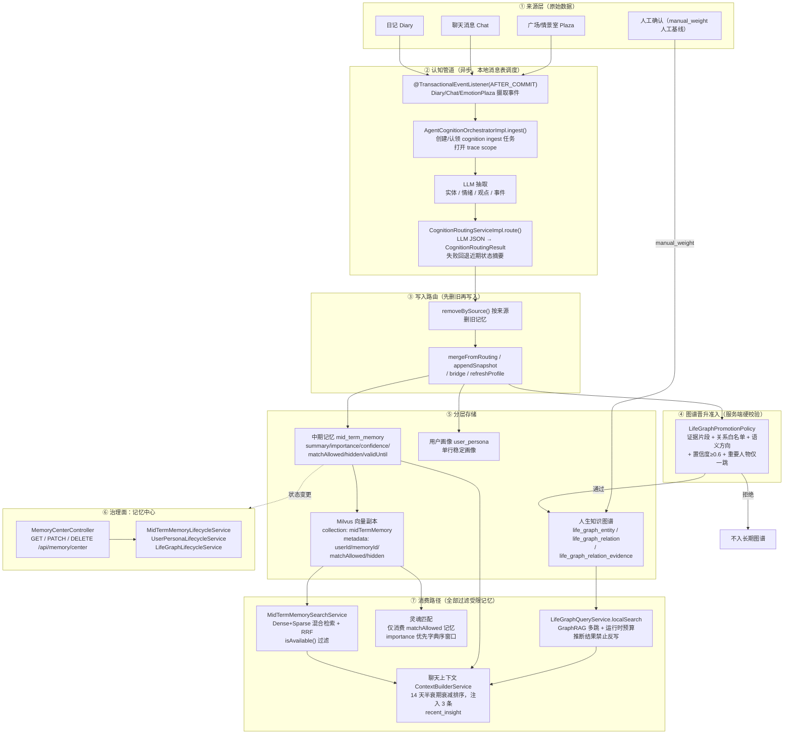

# 予思记忆系统全链路设计文档

> 版本：v1.0 ｜ 基于 Spring Boot 3 + Java 21 + LangChain4j + Milvus + MySQL + Redis(Redisson)
> 文中行号以当前代码版本为准，重构后请以类名/方法名为准。

---

## 1. 概述

记忆系统是予思平台的核心子系统：从用户的**原始表达**（日记、聊天、广场互动）中，经 LLM 认知管道抽取派生认知，构建**三层记忆**（中期记忆 / 用户画像 / 人生知识图谱），并以「隐私优先、读取路径过滤、机器可验证」为原则提供治理与消费能力。

**设计目标：**

1. **业务零阻塞**：认知管道完全异步化，核心业务（写日记、发消息）不同步等待 LLM
2. **隐私底线**：AI 推断的记忆用户有权知情和控制；「AI 自己用」与「用于匹配」是独立授权
3. **可解释可溯源**：每条派生记忆可指回原始来源；图谱关系有来源级证据链
4. **最终一致**：数据库、向量库、图谱三方存储的一致性靠读取路径过滤兜底，不追求强一致

**分层总览：**

```
来源层 → 认知管道 → 分层存储 → 治理面（记忆中心）→ 消费路径
                                            ↘ 遗忘路径（过期/衰减/删除）
```

---

## 2. 全链路流程图



---

## 3. 来源层与认知管道

### 3.1 事件订阅入口

**代码**：[AgentCognitionOrchestratorImpl.java](file:///d:/develop/Java/javacode/yusi/src/main/java/com/aseubel/yusi/service/cognition/impl/AgentCognitionOrchestratorImpl.java) L148-170

- 用 `@TransactionalEventListener(phase = AFTER_COMMIT)` 订阅三类事件：
  - `DiaryCognitionIngestEvent`（日记保存/修改）
  - `ChatCognitionIngestEvent`（聊天消息）
  - `EmotionPlazaCognitionIngestEvent`（广场互动）
- **AFTER_COMMIT 语义**：业务事务提交成功后才触发摄取，业务回滚则不产生记忆——「业务成功则任务必不丢」由数据库事务保证

### 3.2 ingest 主流程

**代码**：同上 L52-92 `ingest()`

1. 校验输入（来源类型、来源 ID、用户 ID）
2. 创建或认领 `cognition ingest` 任务（本地消息表模型：业务与任务记录同库同事务落库，调度器悲观锁批量领取，指数退避重试）
3. 打开运行级 trace scope（runId 贯穿，见《面试问答》Q17）
4. 调用 `ingestBusinessData()` 执行实际摄取

### 3.3 抽取与路由

**代码**：[CognitionRoutingServiceImpl.java](file:///d:/develop/Java/javacode/yusi/src/main/java/com/aseubel/yusi/service/cognition/impl/CognitionRoutingServiceImpl.java) L31-60

- `route()` 调用 cognition routing prompt，从 LLM 响应提取 JSON 反序列化为 `CognitionRoutingResult`
- **降级策略**：解析失败时回退为「近期状态摘要」，绝不因 LLM 输出异常中断管道

**DTO**：[CognitionRoutingResult.java](file:///d:/develop/Java/javacode/yusi/src/main/java/com/aseubel/yusi/pojo/dto/cognition/CognitionRoutingResult.java) L12-22，关键字段：

| 字段 | 含义 |
|---|---|
| `midMemorySummary` | 中期记忆摘要文本 |
| `midMemoryImportance` | 长期价值分（0~1，与置信度区分） |
| `midMemoryCategory` | 记忆类别，见下表 |

**类别枚举**：[MidMemoryCategory.java](file:///d:/develop/Java/javacode/yusi/src/main/java/com/aseubel/yusi/pojo/constant/MidMemoryCategory.java) L6-26

| 类别 | 含义 |
|---|---|
| `EMOTION_OR_STATE` | 情绪或状态类 |
| `EVENT_OR_PLAN` | 事件或计划类 |
| `PREFERENCE_OR_HABIT` | 偏好或习惯类 |

### 3.4 抽取后的消费链路

**代码**：[AgentCognitionOrchestratorImpl.java](file:///d:/develop/Java/javacode/yusi/src/main/java/com/aseubel/yusi/service/cognition/impl/AgentCognitionOrchestratorImpl.java) L117-146

执行顺序（幂等关键）：

```
removeBySource()      ← 按来源删除旧记忆（同来源重复处理不重复计数）
→ cognitionRoutingService.route()
→ mergeFromRouting()  ← 写入中期记忆 / 画像 / 图谱候选
→ appendSnapshot()    ← 刷新画像快照
→ bridge()            ← 图谱桥接
→ refreshProfile()    ← 刷新匹配画像
```

---

## 4. 三层存储结构

### 4.1 中期记忆（摘要层）

**实体**：[MidTermMemory.java](file:///d:/develop/Java/javacode/yusi/src/main/java/com/aseubel/yusi/pojo/entity/MidTermMemory.java)，`@Table(name = "mid_term_memory")`

核心字段：来源类型/来源 ID、摘要、`importance`、`confidence`、`matchAllowed`、`hidden`、`validUntil`（有效期）、合并目标字段、`createdAt`。

**写入**：[MidMemoryUpdateServiceImpl.java](file:///d:/develop/Java/javacode/yusi/src/main/java/com/aseubel/yusi/service/memory/impl/MidMemoryUpdateServiceImpl.java) L88-123

- 按 `MidMemoryCategory` 设置有效期（**不同类别有效期不同**：状态类短、习惯偏好类长）
- 保存后**异步检测认知冲突**（新记忆与既有记忆矛盾时触发后续治理）

**向量副本**：[MidTermMemoryVectorService.java](file:///d:/develop/Java/javacode/yusi/src/main/java/com/aseubel/yusi/service/memory/MidTermMemoryVectorService.java) L28-68

- `upsert()`：对 `summary` 生成 embedding，写入 Milvus `collectionProperties.getMidTermMemory()` 对应 collection
- metadata 携带 `userId / memoryId / matchAllowed / hidden`，支持服务端标量过滤

### 4.2 用户画像（稳定层）

**实体**：[UserPersona.java](file:///d:/develop/Java/javacode/yusi/src/main/java/com/aseubel/yusi/pojo/entity/UserPersona.java)，`@Table(name = "user_persona")`

单用户单行的稳定画像，由每次认知摄取后 `appendSnapshot()` 增量刷新。

### 4.3 人生知识图谱（结构层）

| 表 | 实体 | 职责 |
|---|---|---|
| `life_graph_entity` | [LifeGraphEntity.java](file:///d:/develop/Java/javacode/yusi/src/main/java/com/aseubel/yusi/pojo/entity/LifeGraphEntity.java) | 节点：`type`（Person/Event/Place 等枚举，L125-134）、`nameNorm`、`displayName`、`mentionCount`、`relationCount` |
| `life_graph_relation` | [LifeGraphRelation.java](file:///d:/develop/Java/javacode/yusi/src/main/java/com/aseubel/yusi/pojo/entity/LifeGraphRelation.java) | 关系边，带语义方向（semantic_source/target） |
| `life_graph_relation_evidence` | [LifeGraphRelationEvidence.java](file:///d:/develop/Java/javacode/yusi/src/main/java/com/aseubel/yusi/pojo/entity/LifeGraphRelationEvidence.java) | 来源级证据链：`sourceType` / `sourceId` / `sourceRevision` / `occurrenceCount` / `evidenceSnippet`（L46-59），唯一键 = 用户+关系+来源类型+来源 ID |
| `life_graph_task` / `life_graph_mention` | [LifeGraphTask.java](file:///d:/develop/Java/javacode/yusi/src/main/java/com/aseubel/yusi/pojo/entity/LifeGraphTask.java) / [LifeGraphMention.java](file:///d:/develop/Java/javacode/yusi/src/main/java/com/aseubel/yusi/pojo/entity/LifeGraphMention.java) | 图谱构建任务与提及记录 |

---

## 5. 图谱晋升准入（Promotion）

**核心类**：[LifeGraphPromotionPolicy.java](file:///d:/develop/Java/javacode/yusi/src/main/java/com/aseubel/yusi/service/lifegraph/LifeGraphPromotionPolicy.java)

**设计动机**：模型抽取不能直接入长期图谱——过度泛化的转述/假设性信息会污染长期记忆，摧毁用户信任。因此采用两阶段：抽取宽范围 → 晋升硬校验。

**五条硬校验规则**（服务端代码强制，不信任模型自觉）：

| # | 规则 | 代码位置 |
|---|---|---|
| 1 | 必须携带原文证据片段（`evidenceSnippet`） | L216-223 |
| 2 | 关系类型在白名单内（[LifeGraphRelationType.java](file:///d:/develop/Java/javacode/yusi/src/main/java/com/aseubel/yusi/service/lifegraph/LifeGraphRelationType.java)：Person 关系 / Value 关系 / 被拒绝关系枚举） | L5-32 |
| 3 | 关系有明确语义方向 | 同上 |
| 4 | 置信度 ≥ `MIN_RELATION_CONFIDENCE = 0.6`（常量定义 L28-31；阈值行为由评测套件边界断言锁定：0.60 通过 / 0.59 拒绝） | L28-31, L216-223 |
| 5 | 拓扑边界：仅允许 User→Person 关系作为新重要人物的自动入口，重要人物只向一跳属性/事件扩展，禁止 Person→Person 自动扩散 | L72-97 |

阈值 0.6 的量级含义：「有多条证据或单一强证据」。压太紧图谱稀疏失去价值，太松污染风险回归——阈值被机器可读的评测覆盖，调整前先跑评测看影响面。

---

## 6. 记忆生命周期状态机

**状态由 MidTermMemory 上的独立字段表达**（不是单字段状态机）：`hidden`、`matchAllowed`、`validUntil`、合并目标。多条维度可叠加。

```mermaid
stateDiagram-v2
    [*] --> Active: 认知管道写入<br/>默认 matchAllowed=false
    Active --> Hidden: 用户隐藏（记忆中心）
    Hidden --> Active: 用户恢复
    Active --> Corrected: 用户纠正（覆盖摘要内容）
    Active --> Merged: 合并进其他记忆<br/>（合并目标字段指向）
    Active --> Expired: 超过 validUntil<br/>按类别有效期不同
    Active --> Deleted: 用户删除
    Deleted --> [*]: DB 删除 + 向量副本级联清理<br/>+ 图谱证据来源撤销
    Corrected --> Active

    note right of Active
        读取路径统一过滤条件（isAvailable()）：
        hidden / expired / merged / 未授权
        → 三条消费路径全部看不到受限记忆
    end note
    note bottom of Deleted
        向量删除失败只告警不阻断：
        读取路径过滤兜底最终一致
    end note
```

**两条时间衰减链（并行存在，互不冲突）：**

| 链 | 机制 | 效果 |
|---|---|---|
| 硬失效 | `validUntil` 到期 | 读取路径直接排除（Expired） |
| 软衰减 | 按 `importance` + 创建时间算 **14 天半衰期** | 不删除，但排序权重指数下降——旧高频记忆不会永远压着新记忆 |

---

## 7. 治理面：记忆中心

### 7.1 REST 接口

**代码**：[MemoryCenterController.java](file:///d:/develop/Java/javacode/yusi/src/main/java/com/aseubel/yusi/controller/MemoryCenterController.java) L40-62

| 接口 | 能力 |
|---|---|
| `GET /api/memory/center` | 查看记忆列表：来源、置信度、有效期、受限状态 |
| `PATCH /api/memory/center/{id}` | 纠正摘要 / 隐藏 / 恢复 / 匹配授权开关 |
| `DELETE /api/memory/center/{id}` | 删除（级联见 §9） |

### 7.2 生命周期服务（按记忆层分工）

| 服务 | 职责 | 关键逻辑 |
|---|---|---|
| [MidTermMemoryLifecycleService.java](file:///d:/develop/Java/javacode/yusi/src/main/java/com/aseubel/yusi/service/memory/MidTermMemoryLifecycleService.java) | 中期记忆的纠正/隐藏/授权/删除 | L99-123：`matchAllowed`、`hidden` 变更后**同步更新 Milvus metadata**；摘要变更且已授权时刷新匹配画像（L115）；状态变更即触发向量同步（L123） |
| [UserPersonaLifecycleService.java](file:///d:/develop/Java/javacode/yusi/src/main/java/com/aseubel/yusi/service/memory/UserPersonaLifecycleService.java) | 用户画像的治理 | L79-81：`matchAllowed` 独立开关；L220：快照携带授权状态 |
| [LifeGraphLifecycleService.java](file:///d:/develop/Java/javacode/yusi/src/main/java/com/aseubel/yusi/service/memory/LifeGraphLifecycleService.java) | 图谱实体/关系的治理 | L134-136：实体级 `matchAllowed`；L118：受权限定；L263：快照同步 |

**两个关键授权原则：**

1. **「AI 自己用」与「用来匹配」是两个独立字段**——授权只阻断匹配路径，不影响 AI 自身的记忆使用
2. **新记忆默认不可匹配**（`matchAllowed=false`）——必须用户显式打开；匹配把一个人的特质暴露给陌生人，风险等级与 AI 自用完全不同

---

## 8. 消费路径（三条读取，全部过滤受限记忆）

### 8.1 聊天上下文注入

**代码**：[ContextBuilderService.java](file:///d:/develop/Java/javacode/yusi/src/main/java/com/aseubel/yusi/service/ai/chat/ContextBuilderService.java) L250-300

- 查询有效近期中期记忆，按 14 天半衰期衰减分排序，**取前 3 条**注入 `<recent_insight importance="...">` 标签
- 短期记忆由 LangChain4j `ChatMemory` 管理；中期记忆/图谱由检索工具按需注入
- 即时感知类问题走向量检索，长期事实类问题走 GraphRAG（` LifeGraphQueryService`）

### 8.2 语义检索

**代码**：[MidTermMemorySearchService.java](file:///d:/develop/Java/javacode/yusi/src/main/java/com/aseubel/yusi/service/memory/MidTermMemorySearchService.java) L60-127

- **Dense（Embedding）+ Sparse（BM25）双路召回 → RRF 倒数排名融合**（无需调两路分数量纲、零模型成本）
- Milvus 端按 `userId` 标量过滤 + 应用层 `isAvailable()` 二次过滤 hidden / merged / expired（防御纵深：即使服务端旧向量候选漏出，应用层按记忆 ID 再滤一次）

### 8.3 灵魂匹配

- 匹配画像装配**只消费 `matchAllowed=true`** 的记忆与图谱实体
- 候选窗口按 `importance` 优先、`mentionCount` 次之的**字典序排序**（不用加权公式：没有可靠评测集校准权重系数，字典序行为可解释、可断言）
- 用户未授权的记忆即使被装配流程拿到也会被过滤，泄漏指标（profileLeakCount）在评测中是**零阈值强断言**

### 8.4 GraphRAG 多跳查询

**代码**：[LifeGraphQueryService.java](file:///d:/develop/Java/javacode/yusi/src/main/java/com/aseubel/yusi/service/lifegraph/LifeGraphQueryService.java)

- `localSearch(...)`（L94-113）：设置 `maxEntities / maxRelations / maxMentions` 运行时预算，`visited` + `frontier` 控制遍历防环（L41-48 注释明确：traversal 有运行时预算，无产品级一跳限制——**写入一跳、查询多跳是刻意解耦**）
- 质量约束：路径必须有可见证据、过置信度门槛、必须触达用户本人或已确认重要人物
- **查询推断出的新关系禁止反写数据库**——「推理归推理、事实归事实」

---

## 9. 遗忘与删除级联

### 9.1 自然遗忘

- `validUntil` 硬失效（按类别有效期不同）→ 读取路径排除
- 14 天半衰期软衰减 → 排序沉底，不删除

### 9.2 用户删除（级联顺序）

```
DELETE /api/memory/center/{id}
  → 1. MySQL 物理删除记忆行
  → 2. 级联删除 Milvus 向量副本（MidTermMemoryVectorService）
       失败 → 只告警不阻断（依赖读取路径过滤兜底最终一致）
  → 3. 图谱侧执行「来源撤销」：
       删除该来源贡献的证据 → 按剩余来源重算聚合权重
       ★ 人工基线 manual_weight 不可被来源撤销删除
```

---

## 10. 关键设计决策与权衡

| # | 决策 | 备选方案 | 选择理由 |
|---|---|---|---|
| 1 | 受限记忆**读取路径过滤**而非物理删除 | 隐藏即物理删除 | 一隐藏立即生效；支持恢复；删除才走物理级联 |
| 2 | 中期记忆在 Milvus 存**向量副本**并携带权限 metadata | 只存 MySQL | 语义检索需求；metadata 支持服务端标量预过滤 |
| 3 | 图谱写入走**晋升准入硬校验** | 模型抽取即入库 | 防污染：转述/假设性信息不入长期记忆 |
| 4 | 匹配授权**默认关闭、独立字段** | 默认可匹配 | 匹配暴露对象是陌生人，风险等级不同；信任建立后用户主动开启 |
| 5 | 匹配排序用**字典序**而非加权公式 | 加权评分 | 无可靠评测集校准权重时，字典序可解释、可断言 |
| 6 | 查询推断**禁止反写** | 推断结果回存图谱 | 推理归推理、事实归事实，防止一次查询污染图谱 |
| 7 | 向量删除失败**只告警不阻断** | 强一致阻塞 | 单机形态下可用性优先；应用层二次过滤兜底零泄漏 |

---

## 11. 评测护栏（记忆系统如何被机器锁定）

对应 `src/test/java/com/aseubel/yusi/evaluation/` 下的确定性离线回放体系：

| 套件 | 锁定的记忆行为 |
|---|---|
| memory 生命周期套件 | hidden/expired/merged 过滤、有效期行为、衰减排序 |
| lifegraph promotion 套件 | 0.60/0.59 边界断言、白名单、一跳拓扑 |
| lifegraph timeline / rebuild / projection / importance 套件 | 来源替换事务、时间线重建、importance 消费 |
| match 质量套件 | profileLeakCount **零阈值**强断言（含正向检索对照防「假通过」） |

原则：所有隐私与生命周期规则**不是文档约定，是代码强制的断言**——任何改动破坏边界，构建直接失败。

---

## 12. 附录：核心类索引

| 环节 | 类 | 路径 |
|---|---|---|
| 摄取编排 | `AgentCognitionOrchestratorImpl` | service/cognition/impl/ |
| 抽取路由 | `CognitionRoutingServiceImpl` | service/cognition/impl/ |
| 路由结果 DTO | `CognitionRoutingResult` | pojo/dto/cognition/ |
| 记忆类别 | `MidMemoryCategory` | pojo/constant/ |
| 中期记忆写入 | `MidMemoryUpdateServiceImpl` | service/memory/impl/ |
| 向量副本读写 | `MidTermMemoryVectorService` | service/memory/ |
| 语义检索 | `MidTermMemorySearchService` | service/memory/ |
| 生命周期治理 | `MidTermMemoryLifecycleService` / `UserPersonaLifecycleService` / `LifeGraphLifecycleService` | service/memory/ |
| 记忆中心入口 | `MemoryCenterController` | controller/ |
| 图谱晋升 | `LifeGraphPromotionPolicy` / `LifeGraphRelationType` | service/lifegraph/ |
| 图谱查询 | `LifeGraphQueryService` | service/lifegraph/ |
| 聊天注入 | `ContextBuilderService` | service/ai/chat/ |
| 实体 | `MidTermMemory` / `UserPersona` / `LifeGraphEntity` / `LifeGraphRelation` / `LifeGraphRelationEvidence` | pojo/entity/ |
